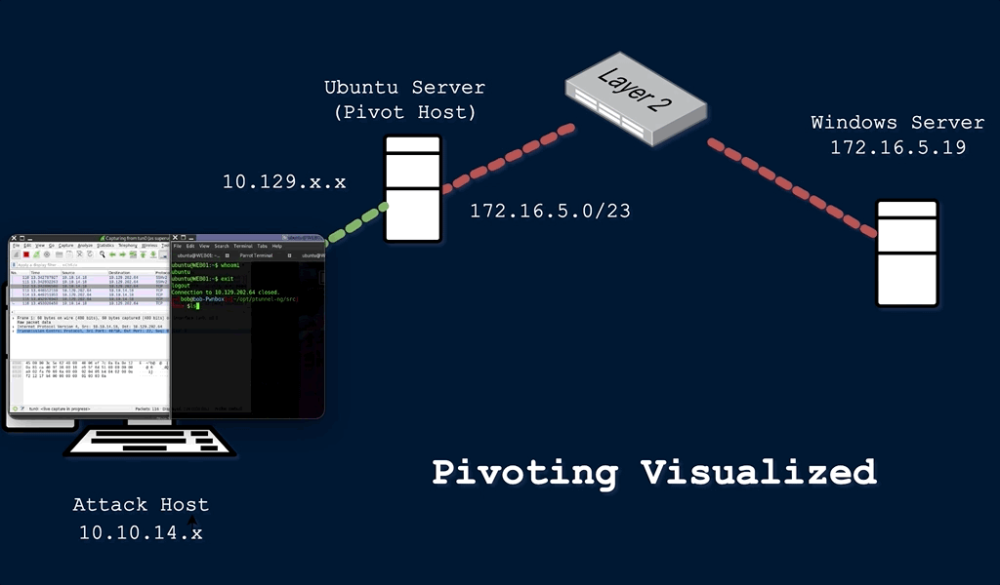

### Introduction to Pivoting, Tunneling, and Port Forwarding

```
# In many situations where we might have already compromised the required credentials, ssh keys, hashes, or access tokens
# to move onto another host, but there may be no other host directly reachable from our attack host. 
# In such cases, we may need to use a pivot host that we have already compromised to find a way to our next target.
```

```
# One of the most important things to do when landing on a host for the first time is to check our privilege level, 
# network connections, and potential VPN or other remote access software. 
```

```
# Pivoting is essentially the idea of moving to other networks through 
# a compromised host to find more targets on different network segments.
```

```
# There are many different terms used to describe a compromised host that we can use to pivot:

-Pivot Host
-Proxy
-Foothold
-Beach Head system
-Jump Host

etc.
```

```
# Pivoting's primary use is to defeat segmentation (both physically and virtually) to access an isolated network. 
# Tunneling, on the other hand, is a subset of pivoting. 
# Tunneling encapsulates network traffic into another protocol and routes traffic through it. 
```

```
With pivoting, we will notice that this is often referred to as Lateral Movement.
```



### Lateral Movement, Pivoting, and Tunneling Compared

```
One practical example of Lateral Movement would be:

During an assessment, we gained initial access to the target environment and were able to gain control of the local administrator account. We performed a network scan and found three more Windows hosts in the network. We attempted to use the same local administrator credentials, and one of those devices shared the same administrator account. We used the credentials to move laterally to that other device, enabling us to compromise the domain further.
```

```
One practical example of Pivoting would be:

During one tricky engagement, the target had their network physically and logically separated. This separation made it difficult for us to move around and complete our objectives. We had to search the network and compromise a host that turned out to be the engineering workstation used to maintain and monitor equipment in the operational environment, submit reports, and perform other administrative duties in the enterprise environment. That host turned out to be dual-homed (having more than one physical NIC connected to different networks). Without it having access to both enterprise and operational networks, we would not have been able to pivot as we needed to complete our assessment.
```

```
One practical example of Tunneling would be:

One way we used Tunneling was to craft our traffic to hide in HTTP and HTTPS. This is a common way we maintained Command and Control (C2) of the hosts we had compromised within a network. We masked our instructions inside GET and POST requests that appeared as normal traffic and, to the untrained eye, would look like a web request or response to any old website. If the packet were formed properly, it would be forwarded to our Control server. If it were not, it would be redirected to another website, potentially throwing off the defender checking it out. 
```

### The Networking Behind Pivoting

```
# Whether assigned dynamically or statically, the IP address is assigned to a Network Interface Controller (NIC). 
# Commonly, the NIC is referred to as a Network Interface Card or Network Adapter. 
# A computer can have multiple NICs (physical and virtual), meaning it can have multiple IP addresses assigned, 
# allowing it to communicate on various networks. 
```

```
# Identifying pivoting opportunities will often depend on the specific IPs assigned to the hosts we compromise 
# because they can indicate the networks compromised hosts can reach. 
# This is why it is important for us to always check for additional NICs using commands like 
# ifconfig (in macOS and Linux) and ipconfig (in Windows).

ifconfig

# In the output above, each NIC has an identifier (eth0, eth1, lo, tun0) 
# followed by addressing information and traffic statistics. 

ipconfig

# The output directly above is from issuing ipconfig on a Windows system. 
# We can see that this system has multiple adapters, but only one of them has IP addresses assigned. 
# IPv4 as it remains the most common IP addressing mechanism in enterprise LANs. 
```

```
# Every IPv4 address will have a corresponding subnet mask. 
# If an IP address is like a phone number, the subnet mask is like the area code. 
# Remember that the subnet mask defines the network & host portion of an IP address. 
# When network traffic is destined for an IP address located in a different network, 
# the computer will send the traffic to its assigned default gateway.
```

```
# The default gateway is usually the IP address assigned to a NIC on an appliance acting as the router for a given LAN. 
# In the context of pivoting, we need to be mindful of what networks a host we land on can reach, 
# so documenting as much IP addressing information as possible on an engagement can prove helpful.
```

### Routing

```
# It is common to think of a network appliance that connects us to the Internet when thinking about a router, 
# but technically any computer can become a router and participate in routing. 
# Some of the challenges we will face in this module require us to make a pivot host route traffic to another network. 
# One way we will see this is through the use of AutoRoute, 
# which allows our attack box to have routes to target networks that are reachable through a pivot host. 
```

```
# One key defining characteristic of a router is that it has a routing table 
# that it uses to forward traffic based on the destination IP address. 
# Let's look at this on Pwnbox using the commands netstat -r or ip route.

netstat -r

Kernel IP routing table
Destination     Gateway         Genmask         Flags   MSS Window  irtt Iface
default         178.62.64.1     0.0.0.0         UG        0 0          0 eth0
10.10.10.0      10.10.14.1      255.255.254.0   UG        0 0          0 tun0
10.10.14.0      0.0.0.0         255.255.254.0   U         0 0          0 tun0
10.106.0.0      0.0.0.0         255.255.240.0   U         0 0          0 eth1
10.129.0.0      10.10.14.1      255.255.0.0     UG        0 0          0 tun0
178.62.64.0     0.0.0.0         255.255.192.0   U         0 0          0 eth0
```

### Protocols, Services & Ports

```
# Protocols are the rules that govern network communications. 
# Many protocols and services have corresponding ports that act as identifiers. 
# Logical ports aren't physical things we can touch or plug anything into. 
# They are in software assigned to applications. 
# When we see an IP address, we know it identifies a computer that may be reachable over a network. 
# When we see an open port bound to that IP address, we know that it identifies an application we may be able to connect to. 
# Connecting to specific ports that a device is listening on can often allow us to use ports & 
# protocols that are permitted in the firewall to gain a foothold on the network.
```
-------------------------------------