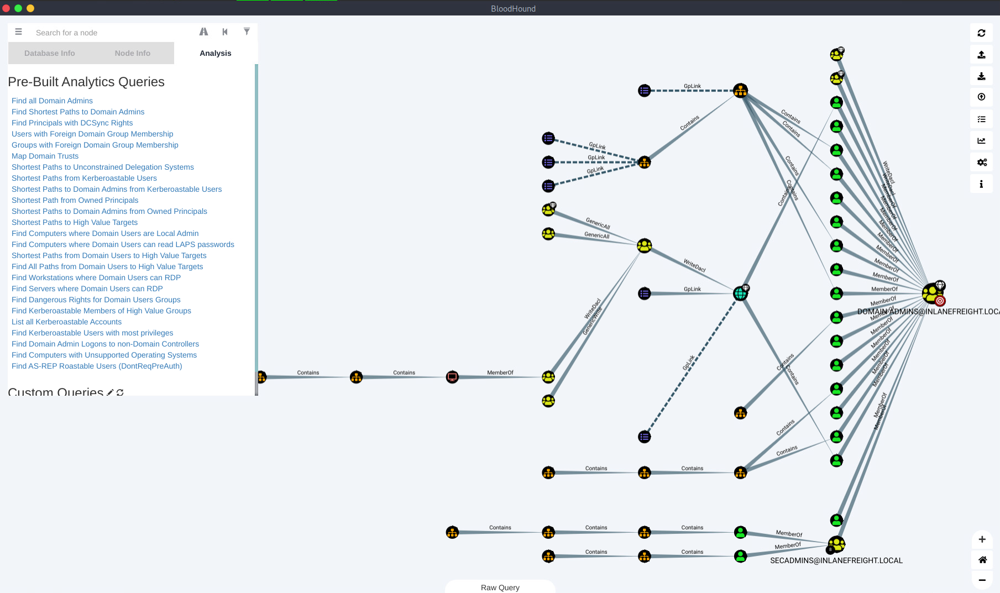

### Enumerating Security Controls

#### Windows Defender

```
# Windows Defender (or Microsoft Defender after the Windows 10 May 2020 Update) has greatly improved over the years and, by default, 
# will block tools such as PowerView. There are ways to bypass these protections.
# We can use the built-in PowerShell cmdlet Get-MpComputerStatus to get the current Defender status. 
# Here, we can see that the RealTimeProtectionEnabled parameter is set to True, 
# which means Defender is enabled on the system.

PS C:\> Get-MpComputerStatus
```

### AppLocker

```
# An application whitelist is a list of approved software applications or executables that are allowed to be present and run on a system. 
# The goal is to protect the environment from harmful malware and unapproved software. 
# AppLocker is Microsoft's application whitelisting solution and gives system administrators control over which applications and files users can run. 
# It provides granular control over executables, scripts, Windows installer files, DLLs, packaged apps, and packed app installers. 

# It is common for organizations to block cmd.exe and PowerShell.exe and write access to certain directories, but this can all be bypassed. 
# Organizations also often focus on blocking the PowerShell.exe executable, but forget about the other PowerShell executable locations such as 
# %SystemRoot%\SysWOW64\WindowsPowerShell\v1.0\powershell.exe or PowerShell_ISE.exe. 
# For example all Domain Users are disallowed from running the 64-bit PowerShell executable located at:

%SystemRoot%\system32\WindowsPowerShell\v1.0\powershell.exe

# So, we can merely call it from other locations. 

PS C:\> Get-AppLockerPolicy -Effective | select -ExpandProperty RuleCollections         # Using Get-AppLockerPolicy cmdlet
```

### PowerShell Constrained Language Mode

https://devblogs.microsoft.com/powershell/powershell-constrained-language-mode/

```
# PowerShell Constrained Language Mode locks down many of the features needed to use PowerShell effectively, such as blocking COM objects, 
# only allowing approved .NET types, XAML-based workflows, PowerShell classes, and more. 
# We can quickly enumerate whether we are in Full Language Mode or Constrained Language Mode.


PS C:\> $ExecutionContext.SessionState.LanguageMode  # Enumerating Language Mode

ConstrainedLanguage
```

### LAPS

[LAPS](https://www.microsoft.com/en-us/download/details.aspx?id=46899)

[LAPSToolkit](https://github.com/leoloobeek/LAPSToolkit)

```
# The Microsoft Local Administrator Password Solution (LAPS) is used to randomize and rotate local administrator passwords 
# on Windows hosts and prevent lateral movement. 
# We can enumerate what domain users can read the LAPS password set for machines with LAPS installed 
# and what machines do not have LAPS installed. 
# The LAPSToolkit greatly facilitates this with several functions. One is parsing ExtendedRights for all computers with LAPS enabled. 
# This will show groups specifically delegated to read LAPS passwords, which are often users in protected groups. 
# An account that has joined a computer to a domain receives All Extended Rights over that host, 
# and this right gives the account the ability to read passwords. 
# Enumeration may show a user account that can read the LAPS password on a host. 
# This can help us target specific AD users who can read LAPS passwords.

PS C:\> Find-LAPSDelegatedGroups            # Using Find-LAPSDelegatedGroups

# The Find-AdmPwdExtendedRights checks the rights on each computer with LAPS enabled for any groups with read access 
# and users with "All Extended Rights." 
# Users with "All Extended Rights" can read LAPS passwords and may be less protected than users in delegated groups, 
# so this is worth checking for.

PS C:\htb> Find-AdmPwdExtendedRights        # Using Find-AdmPwdExtendedRights

# We can use the Get-LAPSComputers function to search for computers that have LAPS enabled when passwords expire, 
# and even the randomized passwords in cleartext if our user has access.

PS C:\htb> Get-LAPSComputers                # Using Get-LAPSComputers
```

### Credentialed Enumeration - from Linux

```
# Since we have a general idea about the domain's userbase and machines, it's time to enumerate the domain in depth. 
# We are interested in information about domain user and computer attributes, 
# group membership, Group Policy Objects, permissions, ACLs, trusts, and more. 
# We have various options available, but the most important thing to remember is that most of these tools 
# will not work without valid domain user credentials at any permission level. 
# So at a minimum, we will have to have acquired a user's cleartext password, NTLM password hash, 
# or SYSTEM access on a domain-joined host.
```

### CrackMapExec

[CrackMapExec](https://github.com/byt3bl33d3r/CrackMapExec)

```
# CrackMapExec (CME) is a powerful toolset to help with assessing AD environments. 
# It utilizes packages from the Impacket and PowerSploit toolkits to perform its functions. 
# For detailed explanations on using the tool and accompanying modules, see the wiki. 

crackmapexec -h                 # CME Help Menu
```

```
# We can see that we can use the tool with MSSQL, SMB, SSH, and WinRM credentials. 
# Let's look at our options for CME with the SMB protocol:

crackmapexec smb -h             # CME Options (SMB)

# CME offers a help menu for each protocol (i.e., crackmapexec winrm -h, etc.). 
# Be sure to review the entire help menu and all possible options. 
# For now, the flags we are interested in are:

-u Username The user whose credentials we will use to authenticate
-p Password User's password
Target (IP or FQDN) Target host to enumerate (in our case, the Domain Controller)
--users Specifies to enumerate Domain Users
--groups Specifies to enumerate domain groups
--loggedon-users Attempts to enumerate what users are logged on to a target, if an
```

### CME - Domain User Enumeration

```
# We start by pointing CME at the Domain Controller and using the credentials for the forend user to retrieve a list of all domain users. 
# Notice when it provides us the user information, it includes data points such as the badPwdCount attribute. 
# This is helpful when performing actions like targeted password spraying. 
# We could build a target user list filtering out any users with their badPwdCount attribute above 0 
# to be extra careful not to lock any accounts out.

sudo crackmapexec smb 172.16.5.5 -u forend -p Klmcargo2 --users

# We can also obtain a complete listing of domain groups. 
# We should save all of our output to files to easily access it again later for reporting or use with other tools.:

sudo crackmapexec smb 172.16.5.5 -u forend -p Klmcargo2 --groups

# The above snippet lists the groups within the domain and the number of users in each. 
# The output also shows the built-in groups on the Domain Controller, such as Backup Operators. 
# We can begin to note down groups of interest. 
# Take note of key groups like Administrators, Domain Admins, Executives, any groups that may contain privileged IT admins, etc.
# These groups will likely contain users with elevated privileges worth targeting during our assessment.
```

### CME - Logged On Users

```
# We can also use CME to target other hosts. 
# Let's check out what appears to be a file server to see what users are logged in currently.

sudo crackmapexec smb 172.16.5.130 -u forend -p Klmcargo2 --loggedon-users

# We see that many users are logged into this server which is very interesting. 
# We can also see that our user forend is a local admin because (Pwn3d!) appears 
# after the tool successfully authenticates to the target host. 
# A host like this may be used as a jump host or similar by administrative users. 
# We can see that the user svc_qualys is logged in, who we earlier identified as a domain admin. 
# It could be an easy win if we can steal this user's credentials from memory or impersonate them.
```

### CME Share Searching

```
# We can use the --shares flag to enumerate available shares on the remote host 
# and the level of access our user account has to each share (READ or WRITE access). 
# Let's run this against the INLANEFREIGHT.LOCAL Domain Controller.

sudo crackmapexec smb 172.16.5.5 -u forend -p Klmcargo2 --shares      # Share Enumeration - Domain Controller

# We see several shares available to us with READ access. 
# The Department Shares, User Shares, and ZZZ_archive shares would be worth digging into further 
# as they may contain sensitive data such as passwords or PII. 

# Next, we can dig into the shares and spider each directory looking for files. 
# The module spider_plus will dig through each readable share on the host and list all readable files.:

sudo crackmapexec smb 172.16.5.5 c -M spider_plus --share 'Department Shares'     # Using Spider_plus

# When completed, CME writes the results to a JSON file located at /tmp/cme_spider_plus/<ip of host>. 
# We could dig around for interesting files such as web.config files or scripts that may contain passwords.:

head -n 10 /tmp/cme_spider_plus/172.16.5.5.json
```

### SMBMap

```
# SMBMap is great for enumerating SMB shares from a Linux attack host. 
# It can be used to gather a listing of shares, permissions, and share contents if accessible.

# Like CME, we can use SMBMap and a set of domain user credentials to check for accessible shares on remote systems. 
# As with other tools, we can type the command smbmap -h to view the tool usage menu. 
# Aside from listing shares, we can use SMBMap to recursively list directories, list the contents of a directory, 
# search file contents, and more. This can be especially useful when pillaging shares for useful information.

smbmap -u forend -p Klmcargo2 -d INLANEFREIGHT.LOCAL -H 172.16.5.5        # SMBMap To Check Access

# The other non-standard shares, such as Department Shares and the user and archive shares, are most interesting. 
# Let's do a recursive listing of the directories in the Department Shares share. 
# We can see, as expected, subdirectories for each department in the company.

smbmap -u forend -p Klmcargo2 -d INLANEFREIGHT.LOCAL -H 172.16.5.5 -R 'Department Shares' --dir-only    # Recursive List Of All Directories

# As the recursive listing dives deeper, it will show you the output of all subdirectories within the higher-level directories. 
# The use of --dir-only provided only the output of all directories and did not list all files. 
```

### rpcclient

[rpcclient](https://www.samba.org/samba/docs/current/man-html/rpcclient.1.html)

```
# rpcclient is a handy tool created for use with the Samba protocol and to provide extra functionality via MS-RPC. 
# It can enumerate, add, change, and even remove objects from AD.

rpcclient -U "" -N 172.16.5.5                   # SMB NULL check Session with rpcclient
```

### rpcclient Enumeration

```
# While looking at users in rpcclient, you may notice a field called rid: beside each user. 
# A Relative Identifier (RID) is a unique identifier (represented in hexadecimal format) 
# utilized by Windows to track and identify objects. 
# To explain how this fits in, let's look at the examples below:

- The SID for the INLANEFREIGHT.LOCAL domain is: S-1-5-21-3842939050-3880317879-2865463114.
- When an object is created within a domain, the number above (SID) will be combined with a RID to make a unique value used to represent the object.
- So the domain user htb-student with a RID:[0x457] Hex 0x457 would = decimal 1111, will have a full user SID of:     
  S-1-5-21-3842939050-3880317879-2865463114-1111.
- This is unique to the htb-student object in the INLANEFREIGHT.LOCAL domain and you will never see this paired value tied to another object in this 
  domain or any other.

# However, there are accounts that you will notice that have the same RID regardless of what host you are on. 
# Accounts like the built-in Administrator for a domain will have a RID [administrator] rid:[0x1f4], 
# which, when converted to a decimal value, equals 500. 
# The built-in Administrator account will always have the RID value Hex 0x1f4, or 500. 
# This will always be the case. Since this value is unique to an object, 
# we can use it to enumerate further information about it from the domain. 
# Let's give it a try again with rpcclient. We will dig a bit targeting the htb-student user.

rpcclient $> queryuser 0x457       # RPCClient User Enumeration By RID

# When we searched for information using the queryuser command against the RID 0x457, 
# RPC returned the user information for htb-student as expected. 
# This wasn't hard since we already knew the RID for htb-student. 
# If we wished to enumerate all users to gather the RIDs for more than just one, we would use the enumdomusers command.

rpcclient $> enumdomusers          # Enumdomusers

# Using it in this manner will print out all domain users by name and RID. 
# Our enumeration can go into great detail utilizing rpcclient. 
# We could even start performing actions such as editing users and groups or adding our own into the domain.
```

### Impacket Toolkit

[psexec.py](https://github.com/SecureAuthCorp/impacket/blob/master/examples/psexec.py)
[wmiexec.py](https://github.com/SecureAuthCorp/impacket/blob/master/examples/wmiexec.py)

```
# Impacket is a versatile toolkit that provides us with many different ways to enumerate, 
# interact, and exploit Windows protocols and find the information we need using Python. 
# We could perform many other actions with Impacket, but we will only highlight a few in this section; 
# wmiexec.py and psexec.py. 

psexec.py inlanefreight.local/wley:'transporter@4'@172.16.5.125      # Connect with psexec.py

# Once we execute the psexec module, it drops us into the system32 directory on the target host. 
# We ran the whoami command to verify, and it confirmed that we landed on the host as SYSTEM.
```

```
# wmiexec.py utilizes a semi-interactive shell where commands are executed through Windows Management Instrumentation. 
# It does not drop any files or executables on the target host and generates fewer logs than other modules. 
# After connecting, it runs as the local admin user we connected with 
# (this can be less obvious to someone hunting for an intrusion than seeing SYSTEM executing many commands). 
# This is a more stealthy approach to execution on hosts than other tools, 
# but would still likely be caught by most modern anti-virus and EDR systems. 

wmiexec.py inlanefreight.local/wley:'transporter@4'@172.16.5.5        # Using wmiexec.py
```

### Windapsearch

```
# Windapsearch is another handy Python script we can use to enumerate users, groups, 
# and computers from a Windows domain by utilizing LDAP queries. 
# It is present in our attack host's /opt/windapsearch/ directory.

windapsearch.py -h           # Windapsearch Help

# We have several options with Windapsearch to perform standard enumeration 
# (dumping users, computers, and groups) and more detailed enumeration.

python3 windapsearch.py --dc-ip 172.16.5.5 -u forend@inlanefreight.local -p Klmcargo2 --da     # Windapsearch - Domain Admins

# From the results in the shell above, we can see that it enumerated 28 users from the Domain Admins group. 
# Take note of a few users we have already seen before and may even have a hash or cleartext password.

# To identify more potential users, we can run the tool with the -PU flag and check for users with elevated privileges 
# that may have gone unnoticed. 
# This is a great check for reporting since it will most likely inform the customer 
# of users with excess privileges from nested group membership.

python3 windapsearch.py --dc-ip 172.16.5.5 -u forend@inlanefreight.local -p Klmcargo2 -PU      # Windapsearch - Privileged Users
```

### Bloodhound.py

[Bloodhound.py](https://github.com/fox-it/BloodHound.py)


```
# BloodHound ingestor from our Linux attack host. BloodHound is one of, if not the most impactful tools 
# ever released for auditing Active Directory security.
# We can take large amounts of data that would be time-consuming to sift through and create graphical representations 
# or "attack paths" of where access with a particular user may lead. 
# We will often find nuanced flaws in an AD environment that would have been missed 
# without the ability to run queries with the BloodHound GUI tool and visualize issues. 
# The tool uses graph theory to visually represent relationships 
# and uncover attack paths that would have been difficult, or even impossible to detect with other tools.

# Running bloodhound-python -h from our Linux attack host will show us the options available.

bloodhound-python -h              # BloodHound.py Options

# As we can see the tool accepts various collection methods with the -c or --collectionmethod flag. 
# We can retrieve specific data such as user sessions, users and groups, object properties, 
# ACLS, or select all to gather as much data as possible. Let's run it this way.:

sudo bloodhound-python -u 'forend' -p 'Klmcargo2' -ns 172.16.5.5 -d inlanefreight.local -c all     # Executing BloodHound.py

# The command above executed Bloodhound.py with the user forend. 
# We specified our nameserver as the Domain Controller with the -ns flag and the domain, INLANEFREIGHt.LOCAL with the -d flag. 
# The -c all flag told the tool to run all checks. 
# Once the script finishes, we will see the output files in the current working directory in the format of <date_object.json>.

ls      # Viewing the Results (e.g. 20220307163102_computers.json)
```

### Upload the Zip File into the BloodHound GUI

[BloodHound GUI](https://github.com/BloodHoundAD/BloodHound/releases)

```
# We could then type sudo neo4j start to start the neo4j service, 
# firing up the database we'll load the data into and also run Cypher queries against.

# Next, we can type bloodhound from our Linux attack host when logged in 
# using freerdp to start the BloodHound GUI application and upload the data. 
# The credentials are pre-populated on the Linux attack host, but if for some reason a credential prompt is shown, use:

user == neo4j / pass == HTB_@cademy_stdnt!.

# Once all of the above is done, we should have the BloodHound GUI tool loaded with a blank slate. 
# Now we need to upload the data. 
# We can either upload each JSON file one by one or zip them first with a command such as:

zip -r ilfreight_bh.zip *.json 
 
# and upload the Zip file. We do this by clicking the Upload Data button on the right side of the window (green arrow). 
# When the file browser window pops up to select a file, choose the zip file (or each JSON file) (red arrow) and hit Open.

# Now that the data is loaded, we can use the Analysis tab to run queries against the database. 
# These queries can be custom and specific to what you decide using custom Cypher queries.
```



```
# The query chosen to produce the map above was Find Shortest Paths To Domain Admins. 
# It will give us any logical paths it finds through users/groups/hosts/ACLs/GPOs, etc., 
# relationships that will likely allow us to escalate to Domain Administrator privileges or equivalent. 
# This will be extremely helpful when planning our next steps for lateral movement through the network. 
```

[WADComs](https://wadcoms.github.io/)

```
# As a quick note, checked out the WADComs project. 
# It is an interactive cheat sheet for many of the tools we will cover (and more) in this module. 
# It's hugely helpful when you can't remember exact command syntax or are trying out a tool for the first time.
```

### Task Solution

```
# user / pass from section - -u forend -p Klmcargo2
SSH to 10.129.6.63 (ACADEMY-EA-ATTACK01) with user "htb-student" and password "HTB_@cademy_stdnt!" 

ssh htb-student@10.129.6.63 
rpcclient -U "" -N 172.16.5.5                   # SMB NULL check Session with rpcclient, in we in
rpcclient $> enumdomusers                       # Enumdomusers, convert 1170 to hex and find user

# check rpcclient other command and will find enumdomgroups and querygroup, use them

rpcclient $> enumdomgroups                      # Find target group and it's hex number
rpcclient $> querygroup  <HEX>                  # Findout group memeber quantity by group hex number
```

### Credentialed Enumeration - from Windows

```
# We will experiment with a few tools for enumerating from a Windows attack host, 
# such as SharpHound/BloodHound, PowerView/SharpView, Grouper2, Snaffler, 
# and some built-in tools useful for AD enumeration. 
```

### ActiveDirectory PowerShell Module

```
# The ActiveDirectory PowerShell module is a group of PowerShell cmdlets for administering an Active Directory environment from the command line. 
# It consists of 147+ different cmdlets.

# Before we can utilize the module, we have to make sure it is imported first. 
# The Get-Module cmdlet, which is part of the Microsoft.PowerShell.Core module, 
# will list all available modules, their version, and potential commands for use. 
# This is a great way to see if anything like Git or custom administrator scripts are installed. 
# If the module is not loaded, run Import-Module ActiveDirectory to load it for use.

PS C:\htb> Get-Module                          # Discover Imported Modules
PS C:\htb> Import-Module ActiveDirectory       # Import AD module
PS C:\htb> Get-Module                          # check again

PS C:\htb> Get-ADDomain                        # Get Domain Info

# Next, we'll use the Get-ADUser cmdlet. We will be filtering for accounts with the ServicePrincipalName property populated.
# This will get us a listing of accounts that may be susceptible to a Kerberoasting attack:

PS C:\htb> Get-ADUser -Filter {ServicePrincipalName -ne "$null"} -Properties ServicePrincipalName     # Get-ADUser

# Another interesting check we can run utilizing the ActiveDirectory module, 
# would be to verify domain trust relationships using the Get-ADTrust cmdlet:

PS C:\htb> Get-ADTrust -Filter *                       # Checking For Trust Relationships

# Next, we can gather AD group information using the Get-ADGroup cmdlet:

PS C:\htb> Get-ADGroup -Filter * | select name         # Group Enumeration

# We can take the results and feed interesting names back into the cmdlet 
# to get more detailed information about a particular group like so:

PS C:\htb> Get-ADGroup -Identity "Backup Operators"    # Detailed Group Info

# Now that we know more about the group, let's get a member listing using the Get-ADGroupMember cmdlet:

PS C:\htb> Get-ADGroupMember -Identity "Backup Operators"

# Try repeating the process with a few different groups. You will see that this process can be tedious, 
# and we will be left with an enormous amount of data to sift through. 
# We must know how to do this with built-in tools such as the ActiveDirectory PowerShell module, 
# but we will how much tools like BloodHound can speed up this process and make our results far more accurate and organized.
```

### PowerView

[PowerView](https://github.com/PowerShellMafia/PowerSploit/tree/master/Recon)

```
# PowerView is a tool written in PowerShell to help us gain situational awareness within an AD environment. 
# Much like BloodHound, it provides a way to identify where users are logged in on a network, 
# enumerate domain information such as users, computers, groups, ACLS, trusts, 
# hunt for file shares and passwords, perform Kerberoasting, and more.
```

```
# Let's examine some of PowerView's capabilities and see what data it returns. 
# The table below describes some of the most useful functions PowerView offers.

# Command                                  # Description

Export-PowerViewCSV                        # Append results to a CSV file
ConvertTo-SID                              # Convert a User or group name to its SID value
Get-DomainSPNTicket                        # Requests the Kerberos ticket for a specified Service Principal Name (SPN) account

# Domain/LDAP Functions:

Get-Domain                                 # Will return the AD object for the current (or specified) domain
Get-DomainController                       # Return a list of the Domain Controllers for the specified domain
Get-DomainUser                             # Will return all users or specific user objects in AD
Get-DomainComputer                         # Will return all computers or specific computer objects in AD
Get-DomainGroup                            # Will return all groups or specific group objects in AD
Get-DomainOU                               # Search for all or specific OU objects in AD
Find-InterestingDomainAcl                  # Finds object ACLs in the domain with modification rights set to non-built in objects
Get-DomainGroupMember                      # Will return the members of a specific domain group
Get-DomainFileServer                       # Returns a list of servers likely functioning as file servers
Get-DomainDFSShare                         # Returns a list of all distributed file systems for the current (or specified) domain

# GPO Functions:

Get-DomainGPO                              # Will return all GPOs or specific GPO objects in AD
Get-DomainPolicy                           # Returns the default domain policy or the domain controller policy for the current domain

# Computer Enumeration Functions:

Get-NetLocalGroup                          # Enumerates local groups on the local or a remote machine
Get-NetLocalGroupMember                    # Enumerates members of a specific local group
Get-NetShare                               # Returns open shares on the local (or a remote) machine
Get-NetSession                             # Will return session information for the local (or a remote) machine
Test-AdminAccess                           # Tests if the current user has administrative access to the local (or a remote) machine

# Threaded 'Meta'-Functions:

Find-DomainUserLocation                    # Finds machines where specific users are logged in
Find-DomainShare                           # Finds reachable shares on domain machines
Find-InterestingDomainShareFile            # Searches for files matching specific criteria on readable shares in the domain
Find-LocalAdminAccess                      # Find machines on the local domain where the current user has local administrator access

# Domain Trust Functions:

Get-DomainTrust                            # Returns domain trusts for the current domain or a specified domain
Get-ForestTrust                            # Returns all forest trusts for the current forest or a specified forest
Get-DomainForeignUser                      # Enumerates users who are in groups outside of the user's domain
Get-DomainForeignGroupMember               # Enumerates groups with users outside of the group's domain and returns each foreign member
Get-DomainTrustMapping                     # Will enumerate all trusts for the current domain and any others seen.
```

```
# First up is the Get-DomainUser function. 
# This will provide us with information on all users or specific users we specify. 
# Below we will use it to grab information about a specific user, mmorgan.

PS C:\htb> Get-DomainUser -Identity mmorgan -Domain inlanefreight.local | Select-Object -Property name,samaccountname,description,memberof,whencreated,pwdlastset,lastlogontimestamp,accountexpires,admincount,userprincipalname,serviceprincipalname,useraccountcontrol

# We saw some basic user information with PowerView. 
# Now let's enumerate some domain group information. 
# We can use the Get-DomainGroupMember function to retrieve group-specific information. 
# Adding the -Recurse switch tells PowerView that if it finds any groups that are part 
# of the target group (nested group membership) to list out the members of those groups. 

PS C:\htb>  Get-DomainGroupMember -Identity "Domain Admins" -Recurse           # Recursive Group Membership

# Above we performed a recursive look at the Domain Admins group to list its members. 
# Now we know who to target for potential elevation of privileges. 
# Like with the AD PowerShell module, we can also enumerate domain trust mappings.

PS C:\htb> Get-DomainTrustMapping                                              # Trust Enumeration

# We can use the Test-AdminAccess function to test for local admin access on either the current machine or a remote one.

PS C:\htb> Test-AdminAccess -ComputerName ACADEMY-EA-MS01                      # Testing for Local Admin Access

# Above, we determined that the user we are currently using is an administrator on the host ACADEMY-EA-MS01. 
# We can perform the same function for each host to see where we have administrative access.

# Now we can check for users with the SPN attribute set, 
# which indicates that the account may be subjected to a Kerberoasting attack.

PS C:\htb> Get-DomainUser -SPN -Properties samaccountname,ServicePrincipalName
```

### SharpView

```
# PowerView is part of the now deprecated PowerSploit offensive PowerShell toolkit. 
# The tool has been receiving updates by BC-Security as part of their Empire 4 framework. 
# It is an excellent tool for recon in an Active Directory environment, 
# and is still extremely powerful and helpful in modern AD networks.

PS C:\htb> .\SharpView.exe Get-DomainUser -Help                 # Get help tool guide
PS C:\htb> .\SharpView.exe Get-DomainUser -Identity forend      # Enumerate information about user "forend"

# SharpView can be useful when a client has hardened against PowerShell usage or we need to avoid using PowerShell
```

### Shares

```
# Shares allow users on a domain to quickly access information relevant 
# to their daily roles and share content with their organization. 
# When set up correctly, domain shares will require a user to be domain joined 
# and required to authenticate when accessing the system.
```

```
# We can use PowerView to hunt for shares and then help us dig through them or use various manual commands 
# to hunt for common strings such as files with pass in the name. 
# This can be a tedious process, and we may miss things, especially in large environments. 
# Now, let's take some time to explore the tool Snaffler and see 
# how it can aid us in identifying these issues more accurately and efficiently.
```

### Snaffler

[Snaffler](https://github.com/SnaffCon/Snaffler)

```
# Snaffler is a tool that can help us acquire credentials or other sensitive data in an Active Directory environment. 
# Snaffler works by obtaining a list of hosts within the domain and then enumerating those hosts for shares and readable directories.
# Once that is done, it iterates through any directories readable by our user and hunts for files 
# that could serve to better our position within the assessment. 
# Snaffler requires that it be run from a domain-joined host or in a domain-user context.

Snaffler.exe -s -d inlanefreight.local -o snaffler.log -v data   # Snaffler Execution

# -s tells it to print results to the console for us, 
# -d specifies the domain to search within, 
# -o tells Snaffler to write results to a logfile. 
# -v option is the verbosity level. 
# Typically data is best as it only displays results to the screen, so it's easier to begin looking through the tool runs. 


# We may find passwords, SSH keys, configuration files, or other data that can be used to further our access. 
# Snaffler color codes the output for us and provides us with a rundown of the file types found in the shares.

# Now that we have a wealth of data about the INLANEFREIGHT.LOCAL domain (and hopefully clear notes and log file output!), 
# we need a way to correlate it and visualize it. 
# Let's dive deeper into BloodHound and see how powerful this tool can be during any AD-focused security assessment.
```

### BloodHound

```
# Again Bloodhound is an exceptional open-source tool that can identify attack paths within 
# an AD environment by analyzing the relationships between objects. 
# Both penetration testers and blue teamers can benefit from learning 
# to use BloodHound to visualize relationships in the domain. 

# First, we must authenticate as a domain user from a Windows attack host positioned within the network 
# (but not joined to the domain) or transfer the tool to a domain-joined host.
# For our purposes, we will work with SharpHound.exe already on the attack host, 
# but it's worth experimenting with transferring the tool using methods such as a Python HTTP server, smbserver.py from Impacket, etc.

PS C:\htb>  .\SharpHound.exe --help                           # SharpHound in Action, check help guide
PS C:\htb> .\SharpHound.exe -c All --zipfilename ILFREIGHT    # We'll start by running the SharpHound.exe collector from the MS01 attack host.
```

```
# Next, we can exfiltrate the dataset to our own VM or ingest it into the BloodHound GUI tool on MS01. 
# We can do this on MS01 by typing bloodhound into a CMD or PowerShell console. 
# The credentials should be saved, but enter neo4j: HTB_@cademy_stdnt! if a prompt appears. 
# Next, click on the Upload Data button on the right-hand side, select the newly generated zip file, and click Open. 
# An Upload Progress window will pop up. Once all .json files show 100% complete, click the X at the top of that window.

# We can start by typing domain: in the search bar on the top left and choosing INLANEFREIGHT.LOCAL from the results. 
# Take a moment to browse the node info tab. 
# As we can see, this would be a rather large company with over 550 hosts to target and trusts with two other domains.

# Next we can use some Analysis commands/queries in GUI like: 
- Find Computers with Unsupported Operating Systems, 
- Find Computers where Domain Users are Local Admin
etc.
```

```
# We could land on a host as SYSTEM after a successful attack, 
# but be in a position where it is very difficult or not possible to load tools. 
# What do we do then? We will look at how to perform actions while "Living Off The Land."
```

### Task Solution

```
# RDP to 10.129.244.64 (ACADEMY-EA-MS01) with user "htb-student" and password "Academy_student_AD!" 

xfreerdp -h 
xfreerdp /v:10.129.244.64 /u:htb-student /p:Academy_student_AD!

# Open PowerShell as Administrator

cd ../../Tools                                            # Navigate to Tolls folder
.\SharpHound.exe -c All --zipfilename dataSharphound      # Gather AD info to a zip file

# Start Bloodhound.exe from Bloodhound GUI folder as Administrator
# Upload file, build graph, check quantity of accounts (Analisys, Kerberos Interaction)

# `Test-AdminAccess` will be a target PV function to checl administrative access to a local or remote host
\Snaffler.exe  -d INLANEFREIGHT.LOCAL -s -v data          # Run Snaffler and you'll grab target name and pass from output
```
--------------------------------------------